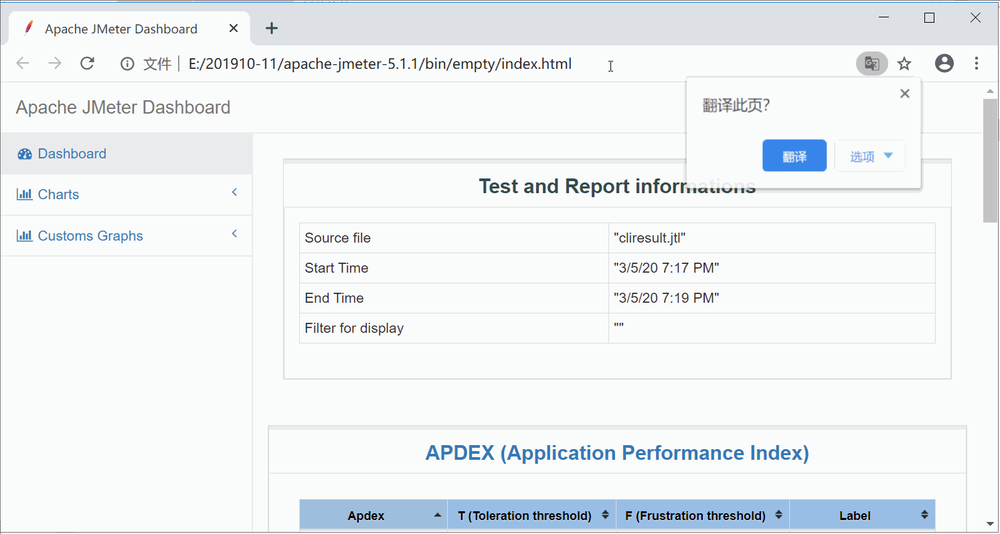
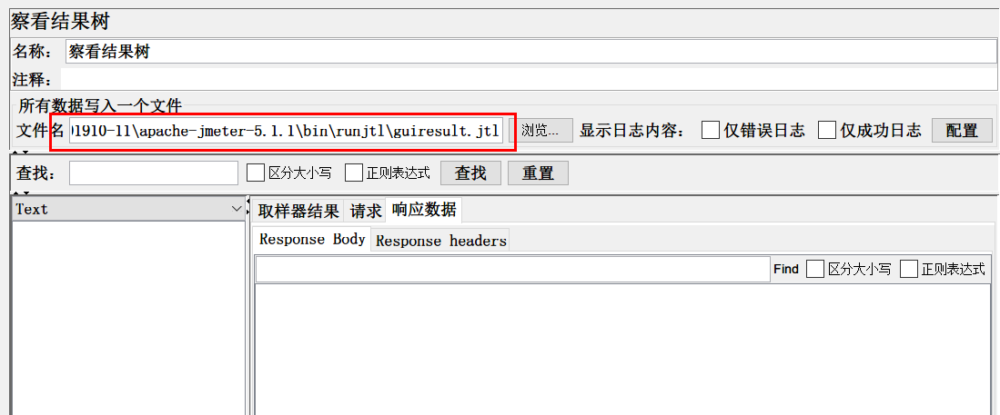
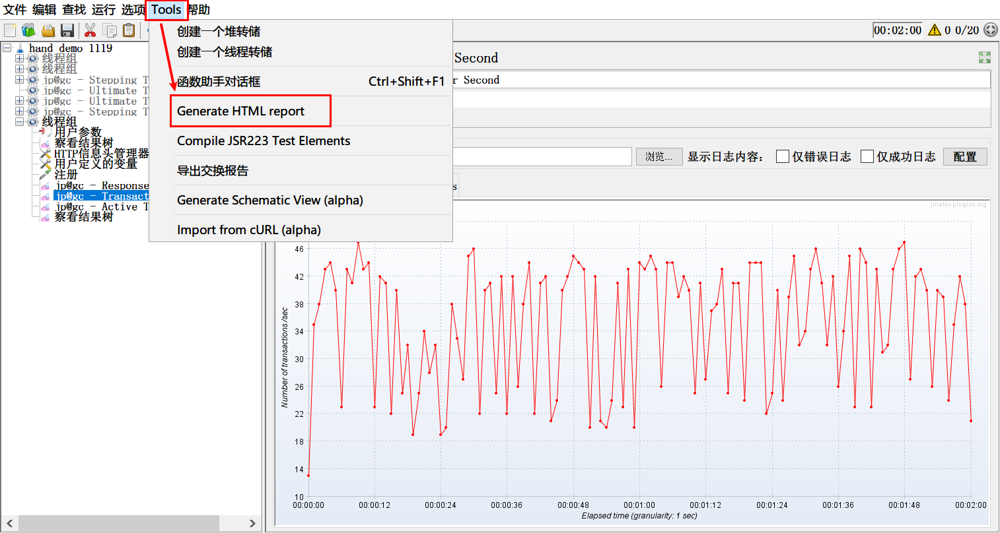
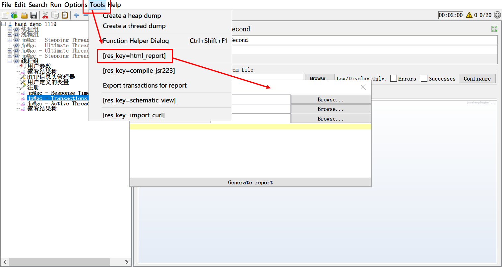
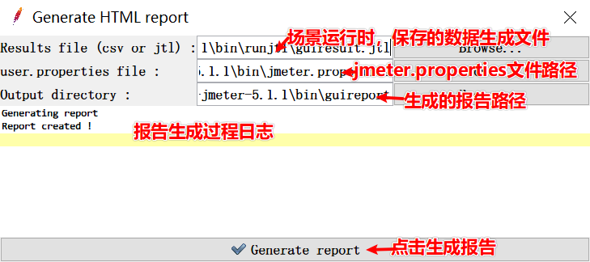
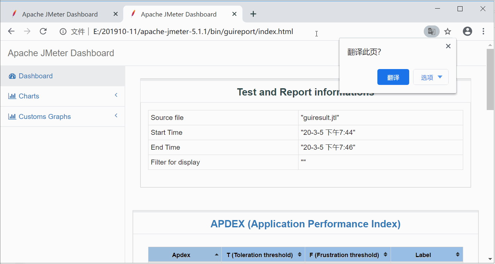

# GUI图形界面Jmeter也能生成html报告，知否？

相信大家在日常工作中，做性能测试，都喜欢用jmeter。在写脚本和调试脚本的时候，都喜欢用GUI图形界面模式；甚至在真正做性能测试的时候，还是喜欢用GUI模式，虽然这种模式，官方不推荐，但是，也耐不住大家对图形界面模式的喜欢。

用GUI模式，做性能测试，添加各种曲线图表后，可以在运行过程中，实时看到运行状态，然后灵活的选择是否结束当前的性能测试。但是，在这种模式下，做性能测试也会有一个极大的困惑，那就是不能很方便生成类似于CLI模式那样专业、标准的测试报告。做完了，想要有测试报告，得自己手动去截图，写测试报告。

**那么，有没有什么办法，在GUI图形界面模式下，生成类似CLI模式的报告呢？**

首先，还是让我们看下，CLI模式，我们生成的报告是什么样？

CLI模式，虽然我们看不到实时运行数据图，但是会再最后生成这样一份报告文件，从这个报告中，我们看到‘随时间变化的响应时间图’ ‘随时间变化的活跃线程数图’ ‘每秒点击数图’ ‘TPS图’ ...... 等多种性能监控的重要图表。如果，你现在用GUI图形界面模式，你也想生成这样一份图表，你知道怎么做吗？

接下来，我就来告诉大家，如何在GUI模式下生成一份这样的测试报告。不过，这个功能必须**要求jmeter的版本在5.1.1及以上。**

**首先**，我们像平时一样，添加各种监视器，然后，要选择任意一个监视器，把性能测试结果写入文件，如下图，这个文件可以自定义路径和名称。但是，路径下的文件最好不要存在，如果已经存在，当运行场景时，会有警告提示。

**接下来**，我们就可以去执行性能测试场景了。 

**待场景执行结束后**，点击jmeter菜单栏中的tools > Generate HTML report或[res_key=html_report] （中文模式时）

或者 tools > [res_key=html_report] （英文模式时）

就会弹出一个生成报告的窗口

好了，所有事情都已经做完了，就看最后的结果了。

看到了吗，在GUI图形界面模式下，也生成了这样一个报告了。最后，我们有几个细节需要注意。

+ **注意：** 
  + 1、这个功能，只有在jmeter5.1.1版本及以上才有。 
  + 2、jmeter.properties文件中有个output_format的属性配置，如果不是默认的csv格式，在生成报告时，会报错。
  + 3、output directory 文件夹一定要为空，如果不为空，则会报错。

好了，这个技术你get到了吗？

> 更多有趣有料的测试知识，欢迎大家关注 **柠檬班** 微信公众号

