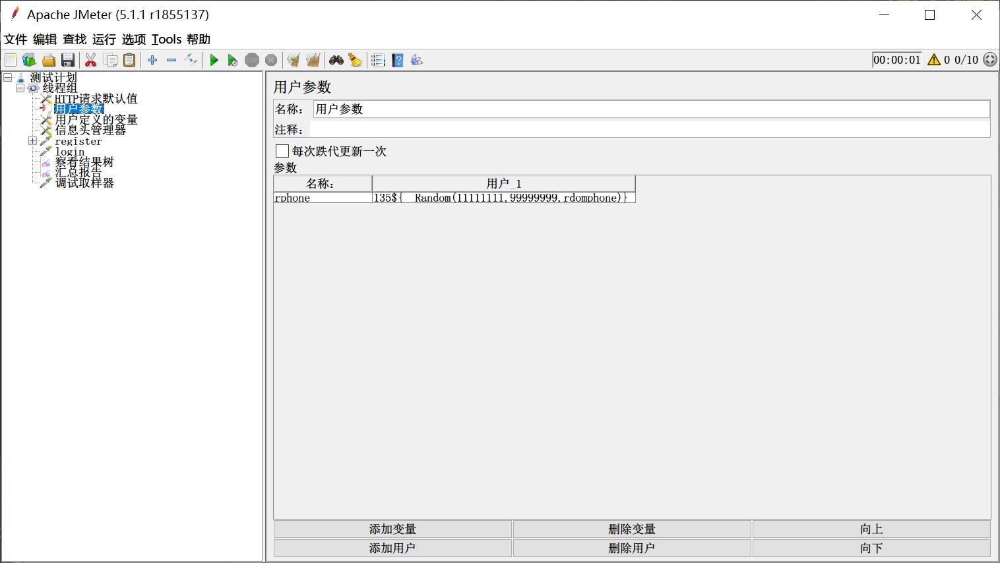
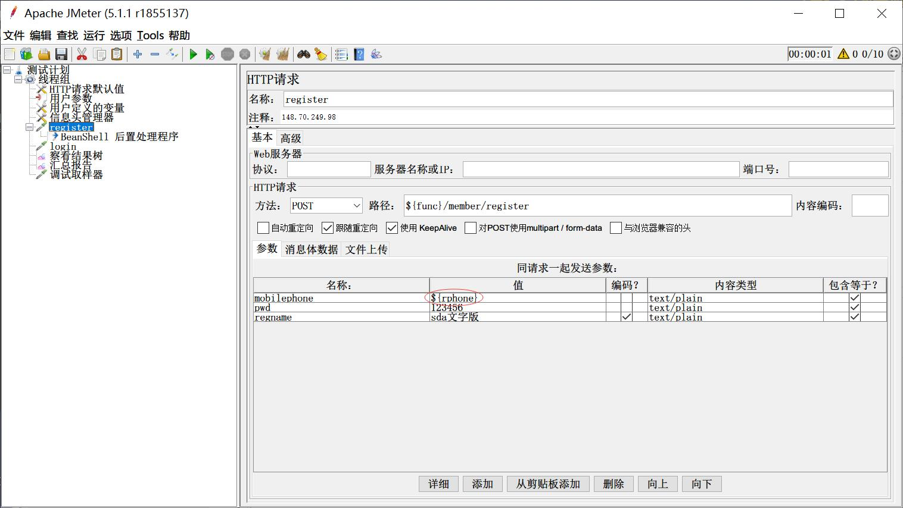
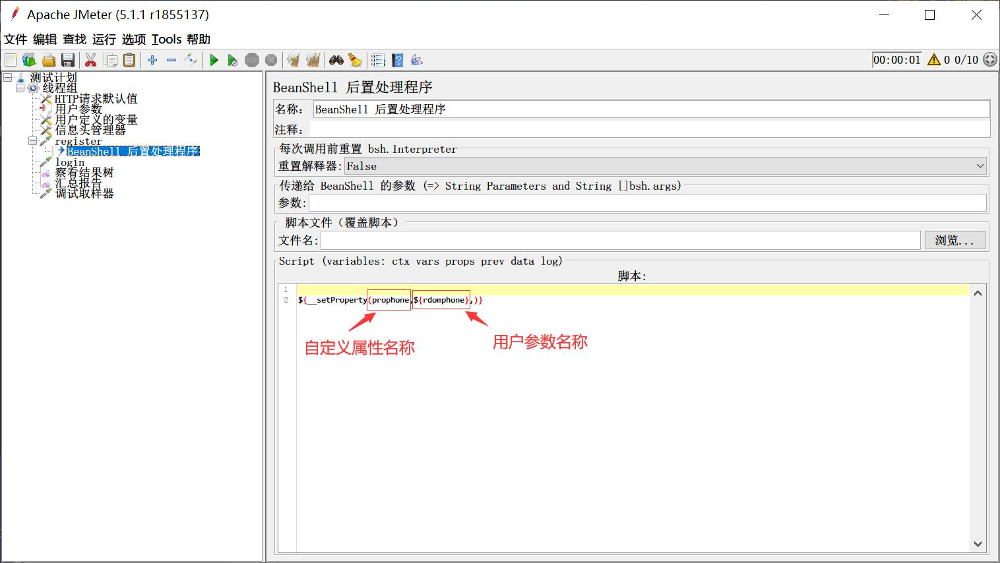
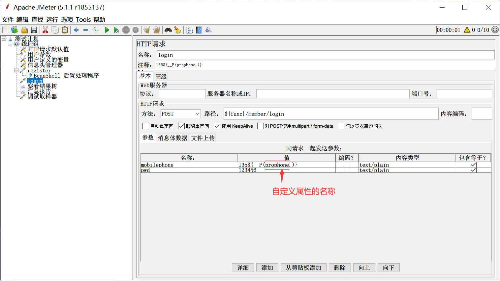
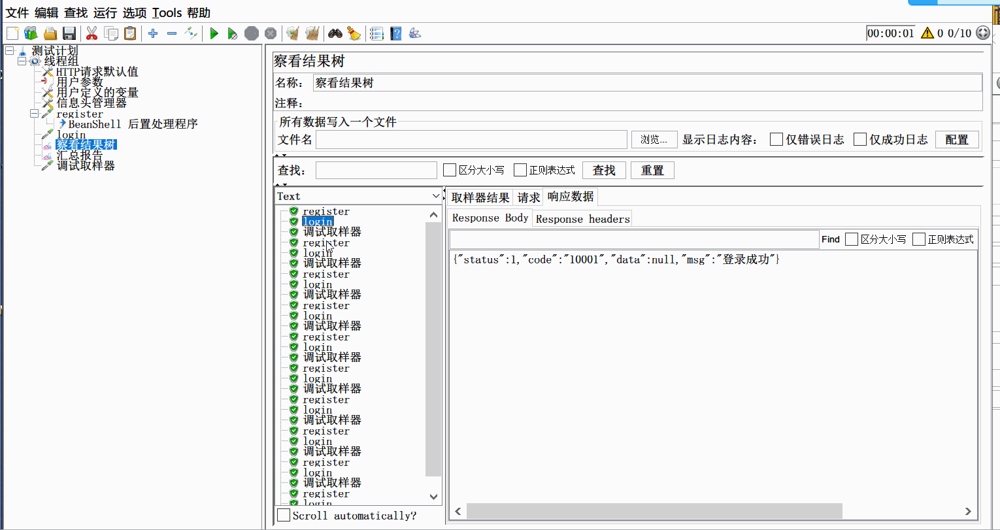

# 完全随机用户注册，如何继续完成登录及之后操作？

​	很多人在学习和使用jmeter做性能测试的过程中，都有这样一个诉求，哪就是做性能测试时，因为用户量不够，所以采用随机规则用户注册，注册之后，就用该用户进行登录及登录之后的操作。

​	这个诉求，看上去非常简单，于是，你就自告奋勇动手噼里啪啦的准备脚本了。可是... 可是... 你发现，你一头扎进了一个无底洞，一连工作了好几天，也百度了无数篇，都没有找到一个简单的，又看得懂的解决办法，甚至还有人告诉你用Beanshell写一堆不知所云的代码。想不想骂娘，*远看‘清水白菜汤’，细品‘山珍海瑶’，——消受不了。*

​	今天，我就给大家介绍一个非常非常简单的办法。

​	诉求：<u>一个系统有两个接口，一个注册、一个登录，注册用户类型为手机号码。现想在jmeter中实现，用一个随机手机号码进行注册，然后再用这个随机号码登录，依据这样一个脚本，设计高用户并发场景，执行性能测试。</u>

​	**常规解决思路**：随机手机号码注册，那就肯定会用 <u>*随机函数*</u> 生成手机号码，生成的这个手机号怎么用呢？①、是直接放到 *<u>http取样器</u>* 的*<u>参数值</u>*中？这样生成的手机号码没有被jmeter接收，注册时生成了一个随机号码，登录时，又会生成一次随机号码，所以，肯定是登录不了的。②、用一个 *<u>用户定义变量</u>*  的 *<u>变量</u>* 接收随机函数生成的号码，注册和登录等接口，都引用这个 变量？用户定义变量，在线程启动时，获取变量及值，运行过程中，不会再获取，跑性能的时候，启动时生成，之后就不会再生成，所以第一次是注册、登录都成功，之后的所有请求都会时号码已被注册，注册失败。③、用一个 *<u>用户参数</u>* 的 *<u>变量</u>* 接收随机函数生成的号码，注册和登录等接口，都引用这个变量？用户参数，在整个性能测试运行过程中，都会动态获取，又回到了第①种情况了。

​	**死胡同之后的提升**：*<u>方法一</u>*、jmeter的变量，其实分为：属性和变量两种。属性又分两种，一种是系统预定义属性(包括系统属性和jmeter属性)，一种是用户自定义属性。系统预定义属性，在jmeter启动前，已经定义，启动时获取；用户自定义属性，是在运行过程中通过命令或函数动态定义属性名称和值。这个知识，是不是给你一点点灵感呢？**解决步骤：**1、先用一个 *<u>用户参数</u>* 的 *<u>变量</u>* 接收随机函数生成的手机号码。2、在注册接口中，使用*<u>用户参数</u>*的*<u>变量</u>*进行注册。3、在注册接口增加一个后置处理器  *<u>Beanshell后置处理器</u>* 在Script区域，写上 ${\_\_setProperty(自定义属性名称,${用户参数的变量名称},)} 。4、在登录及之后用的手机号码的取样器中手机号码参数的值中填写 ${\_\_P(自定义属性名称,)}。至此，脚本编写完成，可以试运行性能场景，看看。是不是完美解决？binggo！！！

> setProperty是jmeter的设置属性函数，P 是jmeter获取属性函数

​	**方法解答**：用户参数，每次使用，都会动态调用，计算一次，所以每次都会生成新值赋给变量，在注册接口中，就用这个变量值，用完之后，把变量值赋给一个自定义属性，这样，jmeter的属性就会动态更新属性及其值，然后在登录接口中，获取属性的值，因为前面已经更新了自定义属性的值，所以登录接口获取到值也更新为对应的值。从而实现了注册接口的手机号与登录手机号一致。

​	有了上面<u>*方法一*</u>的思路，是不是突然眼前一亮，宛如黎明前的朝阳，甘露不息。有了很多新想法和新思路？基于这个提点，再补充两个方法，供大家自己思考。

*<u>方法二、</u>*使用关联，在注册接口上增加一个后置处理器，提取注册的手机号出来，然后再用于登录及之后的接口

*<u>方法三、</u>*把注册的信息写入文件，然后再从文件中提取手机号码，然后再用于登录及之后的接口

​	好了，今天就给大家讲到这。

---
> 想要获取更多有趣有料的测试知识，欢迎关注 **柠檬班** 微信公众号

