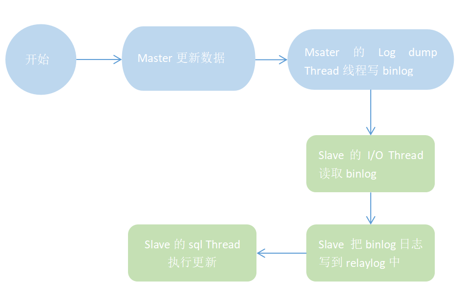
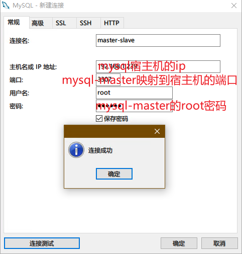
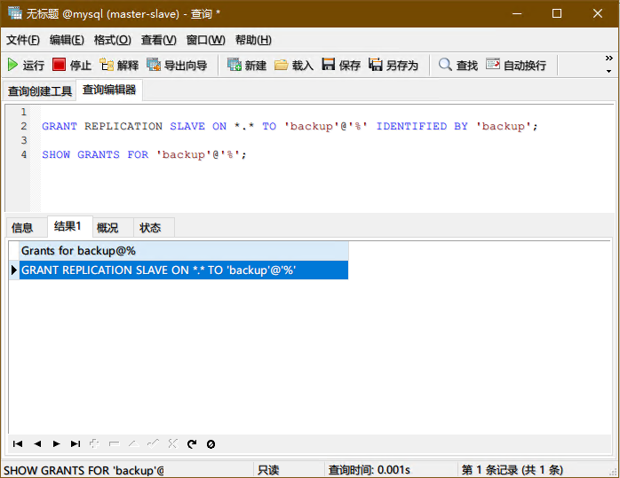
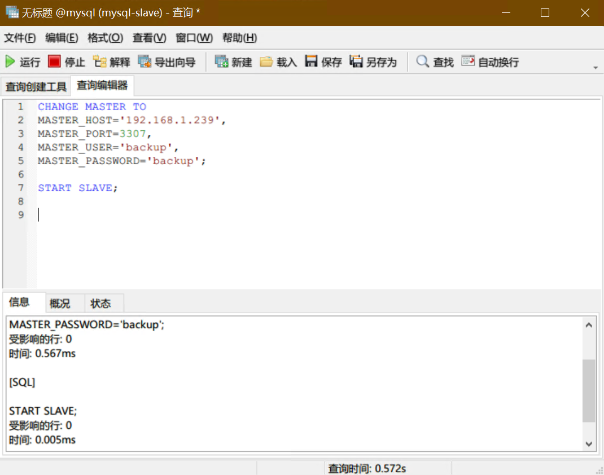
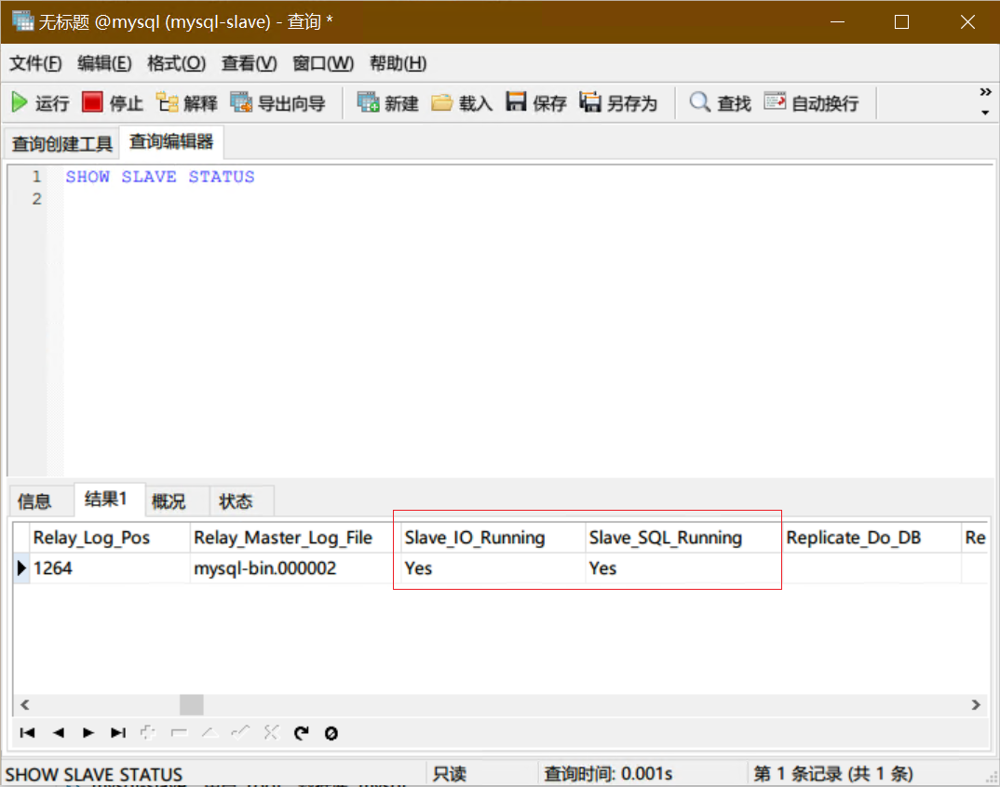

# 快速搭建mysql的主从数据库

## 什么是mysql主从复制？

MySQL Replication(mysql主从复制)是指数据可以从一个mysq数据库主节点复制到一个或多个从节点的方式。

+ mysql的主从复制主要用途有：
  + 读写分离：数据库有锁机制，在锁表时，会影响读操作，使用主从复制，让主库负责写，从库负责读，这样出现锁表，也可以通过读从库保证业务正常。
  + 数据实时备份：当数据库某个节点出现故障时，能快速切换
  + 高可用HA
  + 机构扩展

## mysql主从复制原理



## 搭建mysql主从复制

首先，我们准备一台linux机器(以centos7为例)，在linux中安装docker，用docker创建数据mysql数据库的master和slave。

### 安装docker

```sh
# 安装docker依赖
yum install -y yum-utils device-mapper-persistent-data lvm2

# 安装docker
curl -fsSL https://get.docker.com | bash -s docker --mirror Aliyun

# 设置docker开机启动
systemctl enable docker
```

### 安装mysql的master主数据库

```sh
docker run -itd --restart always --name  mysql-master -p 3307:3306 -e MYSQL_ROOT_PASSWORD=123456 daocloud.io/mysql:5.7

# --restart always 设置数据库容器为开机自启动
# mysql-master为主数据库容器名称，可以自行修改
# -p 3307:3306 为mysql默认的3306端口映射到宿主机的3307端口，可以自行修改
# -e MYSQL_ROOT_PASSWORD=123456 设置主数据库的root密码为123456，可以自行修改
# daocloud.io/mysql:5.7 为mysql数据库镜像，mysql的版本为5.7
```

> 第一次执行，因为要下载mysql的镜像，时间稍微长点，待镜像下载完成后，后续在创建slave数据库容器时，就非常非常快了。

脚本执行完成，主数据库已经创建成功，此时在宿主机防火墙上开放3307端口，或者关闭防火墙(文章以关闭防火墙为例)

```sh
# 关闭防火墙
systemctl disable firewalld
```

### 安装mysql的slave从数据库

```sh
docker run -itd --restart always --name  mysql-slave -p 3308:3306 -e MYSQL_ROOT_PASSWORD=123456 daocloud.io/mysql:5.7

# 命令和创建主数据库一样，只需要修改name和port端口
```

此时，主数据库和从数据库都已经安装好了，接下来，就是配置他们两连接在一起

### 关联mysql-master和mysql-slave组成主从数据库

#### 用Navicat等客户端连接mysql-master主数据库



#### 创建主从复制账号

```sql
GRANT REPLICATION SLAVE ON *.* TO 'backup'@'%' IDENTIFIED BY 'backup';

SHOW GRANTS FOR 'backup'@'%';
```



#### 修改容器的mysqld.cnf

##### 修改mysql-master的mysqld.cnf

从容器中拷贝mysqld.cnf到宿主机

```sh
# 从mysql-master容器中，拷贝mysqld.cnf文件到宿主机当前目录
docker cp mysql-master:/etc/mysql/mysql.conf.d/mysqld.cnf $PWD/mysqld.cnf
```

修改mysqld.cnf

```sh
# 在宿主机上修改mysqld.cnf，修改如下
[mysqld]
pid-file        = /var/run/mysqld/mysqld.pid
socket          = /var/run/mysqld/mysqld.sock
datadir         = /var/lib/mysql
server-id       = 100
log-bin         = mysql-bin


# server-id 是唯一的服务器id，非0整数即可，但不能重复
# log-bin 使用binary logging， mysql-bin是log的文件名称前缀
```

从宿主机拷贝mysqld.cnf文件到容器

```sh
# 从宿主机本地路径中，拷贝修改后的mysql.cnf文件到mysql-master容器
docker cp mysqld.cnf mysql-master:/etc/mysql/mysql.conf.d/mysqld.cnf
```

##### 修改mysql-slave的mysqld.cnf

修改mysqld.cnf

```sh
# 在宿主机上修改mysqld.cnf，修改如下
[mysqld]
pid-file        = /var/run/mysqld/mysqld.pid
socket          = /var/run/mysqld/mysqld.sock
datadir         = /var/lib/mysql
server-id       = 101
log-bin         = mysql-bin

# 与mysql-master相比，server-id发生了变化，不能相同
```

从宿主机拷贝mysqld.cnf文件到容器

```sh
# 从宿主机本地路径中，拷贝修改后的mysqld.cnf文件到mysql-master容器
docker cp mysqld.cnf mysql-slave:/etc/mysql/mysql.conf.d/mysqld.cnf
```

##### 重启容器

```sh
docker restart mysql-master	# 重启主数据库
docker restart mysql-slave	# 重启从数据库
```

#### 用Navicat等客户端连接mysql-slave从数据库

执行

```sql
CHANGE MASTER TO
MASTER_HOST='192.168.1.239',	--宿主机ip
MASTER_PORT=3307,	--mysql-master映射到宿主机的端口
MASTER_USER='backup',
MASTER_PASSWORD='backup';

START SLAVE;
```



成功后，再执行



看到**Slave_IO_Runing、Slave_SQL_Runing**都是**Yes**说明已经配置成功

此时，主从数据库已经配置完成，可以验证一下了。

### 验证

用Navicat等客户端工具，在mysql-master数据库中，创建一个库，然后再在Navicat等客户端中，打开mysql-slave的连接，就能看同样的一个库，也在从库中建立了。

## 知识扩展

### Ⅰ、Navicat等工具，不知道选择哪个库新建查询脚本？

当用Navicat等工具连接到mysql数据库后，发现，有多个数据库，但是，没有选中数据库之前，点击查询按钮，不能用‘新建查询’功能打开查询窗口执行脚本。

遇到这样的问题，可以选择‘mysql’这个库，然后点击查询，再新建查询，就可以打开编辑窗口，写sql语句了。

### Ⅱ、主从数据库的配置文件my.cnf不正确？

对mysql数据库有一定了解的可能都知道，mysql数据库的配置文件是my.cnf，并不是我们文章中的mysqld.cnf文件。

是的，mysql的配置文件确实是my.cnf，但是，在我们用的docker安装5.7版本mysql时，配置文件并不是用my.cnf文件，这个是版本发生了变化。

所以，我们选择了/etc/mysql/mysql.conf.d/mysqld.cnf文件。

### Ⅲ、配置文件中的binary logging是什么意思？

日志是mysql的重要组成部分，mysql的日志主要有：错误日志、查询日志、慢查询日志、事物日志、二进制日志。

二进制日志(binlog)，用于记录数据库执行的写入操作(不包括查询)信息，以二进制的形式保存在磁盘中。在实际应用中，binlog主要使用场景有两个：主从复制 和 数据恢复

### Ⅳ、从数据库连接不到主数据库，Slave_IO_Runing、Slave_SQL_Runing不是Yes状态

出现这样的状况，说明你在[连接mysql-slave从数据库脚本](#用Navicat等客户端连接mysql-slave从数据库) 参数有问题，先 `STOP SLAVE`停止从节点服务，再执行修改后的脚本，再 `START SLAVE` 启动从节点服务，再查看状态 `SHOW SLAVE STATUS`