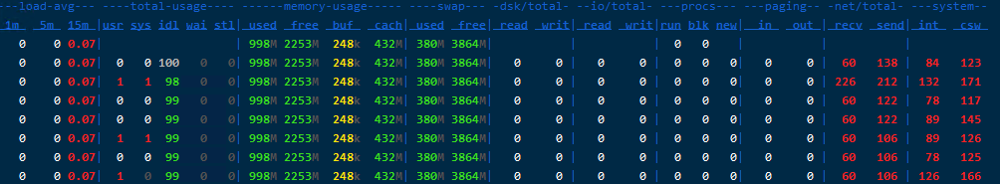
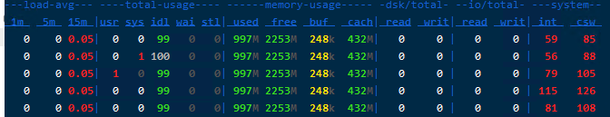
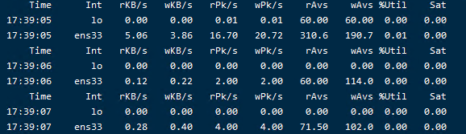
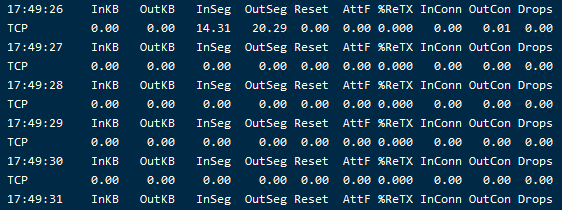

性能分析工具合集

| 工具包  | 命令\工具 | 用途                                                         |
| ------- | --------- | ------------------------------------------------------------ |
|         | top       |                                                              |
|         | ps        | 获取当前系统的进程状态                                       |
| sysstat | vmstat    | 虚拟内存统计的缩写，可对**虚拟内存、进程、cpu**活动进程监控  |
| sysstat | mpstat    | 监控**cpu相关**的统计信息                                    |
| sysstat | pidstat   | 监控全部的指定进程的cpu、内存、线程、设备io等资源占用情况和<font color="red">**上下文切换**</font>信息 |
| sysstat | netstat   | 用于显示与IP\TCP\UDP\ICMP协议相关的数据统计，一般用于**检验本机各端口**的网络连接情况 |
| sysstat | iostat    | 显示设备，分区和网络文件系统的**CPU统计**信息和**输入/输出**统计信息 |
|         | sar       | 显示各种资源的使用情况                                       |


## stress【工具】

### 推荐指数	★★

### 参考

​	参考文章：https://www.cnblogs.com/architectforest/p/12626121.html

### 工具用途

主要用来模拟系统负载较高时的场景， 可以对cpu、memory、IO以及磁盘进行压力测试

### 工具安装

在centos8的源中，暂时还没有包（20200604），先用el7源安装

```sh
wget https://download-ib01.fedoraproject.org/pub/epel/7/x86_64/Packages/s/stress-1.0.4-16.el7.x86_64.rpm

rpm -ivh stress-1.0.4-16.el7.x86_64.rpm

# 如果没有安装wget,可以使用安装: dnf install -y wget 
```

在centos7中安装stress

```shell
sudo yum install -y epel-release
sudo yum install -y stress
```

### 帮助信息

```shell
stress --help
`stress' imposes certain types of compute stress on your system

Usage: stress [OPTION [ARG]] ...
 -?, --help         show this help statement
     --version      show version statement
 -v, --verbose      be verbose
 -q, --quiet        be quiet
 -n, --dry-run      show what would have been done
 -t, --timeout N    timeout after N seconds
     --backoff N    wait factor of N microseconds before work starts
 -c, --cpu N        spawn N workers spinning on sqrt()
 -i, --io N         spawn N workers spinning on sync()
 -m, --vm N         spawn N workers spinning on malloc()/free()
     --vm-bytes B   malloc B bytes per vm worker (default is 256MB)
     --vm-stride B  touch a byte every B bytes (default is 4096)
     --vm-hang N    sleep N secs before free (default none, 0 is inf)
     --vm-keep      redirty memory instead of freeing and reallocating
 -d, --hdd N        spawn N workers spinning on write()/unlink()
     --hdd-bytes B  write B bytes per hdd worker (default is 1GB)

Example: stress --cpu 8 --io 4 --vm 2 --vm-bytes 128M --timeout 10s

Note: Numbers may be suffixed with s,m,h,d,y (time) or B,K,M,G (size).
```

### 帮助说明

| 参数                | 用法说明                                                     |
| ------------------- | ------------------------------------------------------------ |
| **-c, --cpu N**     | 产生n个进程， 每个进程都反复不停的计算随机数的平方根sqrt()   =======**cpu** |
| **-i, --io N**      | 产生n个进程，每个进程反复调用sync()函数，sync()用于将内存写到磁盘上  ====**io** |
| **-m, --vm N**      | 产生n个进程，每个进程反复调用内存分配malloc() 和内存释放free()函数  ====**内存** |
| --vm-bytes B        | 指定调用内存分配malloc()函数时，分配的内容大小(默认 256MB)   |
| --vm-stride B       | 每次创建文件大小(默认 4096)                                  |
| --vm-hang N         | 内存释放前休眠多长时间(单位 秒) 有利于模拟只有少量内存的机器(默认 不休眠) |
| --vm-keep           | 重载内容，而不是释放或重新分配                               |
| **-d, --hdd N**     | 产生n个进程，每个进程反复调用write() 或 unlink() 函数  ========**磁盘** |
| --hdd-bytes B       | 指定持续写文件的大小(默认 1GB)                               |
| **-t, --timeout N** | 持续施压时长     ========**持续时长**                        |
| --backoff N         | 开始施压前，等待 多少微秒                                    |

### 案例实操

**例1：**

**对cpu施压：** `stress -c 1 -t 120`	 向1个cpu持续施压120秒钟

```shell
$ stress -c 1 -t 120
stress: info: [79256] dispatching hogs: 1 cpu, 0 io, 0 vm, 0 hdd

```

用pidstat 查看cpu的使用数据:   `pidstat -p ALL 5`  或用：`mpstat -P ALL 5`

平均时间:   UID       PID    %usr 	%system  %guest   %wait    %CPU   	CPU  Command
平均时间:  1000    108738   **64.99**    0.00    	0.00   	34.73   	**64.99**     -  stress

**结论：** <u>用户态%usr的cpu使用率%CPU非常高，几乎占用了所有的cpu使用</u>

---

**例2：**

**对内存施压：**`stress -m 2 -t 120`  产生2个进程，持续调用内存分配malloc和内存释放free函数120秒钟

然后用 `pidstat -r | grep stress` 可以看到内存占用情况

**例3：**

**对磁盘施压：**`stress -d 2 -t 120`  产生2个进程，持续对磁盘进行write和unlink函数操作120秒钟

然后用 `pidstat -d` 查看情况

**例4：**

**对io施压：**`stress -i 4 -t 120`  产生4个进程，持续调用sync()函数120秒钟

能看到stress的4个进程产生的大量的wait类的cpu使用

再用 `pidstat -u 5 1 `  间隔5秒后输出一组数据，-u表示CPU指标

---

## stress-ng[工具]

### 推荐指数：★★★★

### 参考：

​	https://blog.csdn.net/s1421578048/article/details/104262751

https://zhuanlan.zhihu.com/p/33422310

https://bbs.huaweicloud.com/blogs/140864

### 工具用途：

​	是stress的升级版本，主要模拟压力测试

### 工具安装：

centos7系统安装stress-ng：

```sh
yum install -y epel-release.noarch && yum -y update

yum install -y stress-ng
```

centos8系统安装stress-ng：

```sh
wget http://kernel.ubuntu.com/~cking/tarballs/stress-ng/stress-ng-0.11.18.tar.xz
# http://kernel.ubuntu.com/~cking/tarballs/stress-ng 这个上面可以看到最新的包

# 解压安装
tar -xJvf stress-ng-0.11.18.tar.xz
cd stress-ng-0.11.18
make
sudo make install
```

帮助信息：

```sh
stress-ng --help

stress-ng, version 0.11.18 (gcc 8.3, x86_64 Linux 4.18.0-193.6.3.el8_2.x86_64) 💻🔥

Usage: stress-ng [OPTION [ARG]]

General control options:常规控制选项
      --abort              abort all stressors if any stressor fails
      --aggressive         enable all aggressive options
-a N, --all N              start N workers of each stress test
-b N, --backoff N          wait of N microseconds before work starts
      --class name         specify a class of stressors, use with --sequential
-n,   --dry-run            do not run
-h,   --help               show help
      --ignite-cpu         alter kernel controls to make CPU run hot
      --ionice-class C     specify ionice class (idle, besteffort, realtime)
      --ionice-level L     specify ionice level (0 max, 7 min)
-j,   --job jobfile        run the named jobfile
-k,   --keep-name          keep stress worker names to be 'stress-ng'
      --log-brief          less verbose log messages
      --log-file filename  log messages to a log file
      --maximize           enable maximum stress options
      --max-fd             set maximum file descriptor limit
-M,   --metrics            print pseudo metrics of activity
      --metrics-brief      enable metrics and only show non-zero results
      --minimize           enable minimal stress options
      --no-madvise         don't use random madvise options for each mmap
      --no-rand-seed       seed random numbers with the same constant
      --page-in            touch allocated pages that are not in core
      --parallel N         synonym for 'all N'
      --pathological       enable stressors that are known to hang a machine
      --perf               display perf statistics
-q,   --quiet              quiet output
-r,   --random N           start N random workers
      --sched type         set scheduler type
      --sched-prio N       set scheduler priority level N
      --sched-period N     set period for SCHED_DEADLINE to N nanosecs (Linux only)
      --sched-runtime N    set runtime for SCHED_DEADLINE to N nanosecs (Linux only)
      --sched-deadline N   set deadline for SCHED_DEADLINE to N nanosecs (Liunx only)
      --sched-reclaim      set reclaim cpu bandwidth for deadline schduler (Liunx only)
      --sequential N       run all stressors one by one, invoking N of them
      --stressors          show available stress tests
      --syslog             log messages to the syslog
      --taskset            use specific CPUs (set CPU affinity)
      --temp-path path     specify path for temporary directories and files
      --thrash             force all pages in causing swap thrashing
-t N, --timeout T          timeout after T seconds
      --timer-slack        enable timer slack mode
      --times              show run time summary at end of the run
      --timestamp          timestamp log output
      --tz                 collect temperatures from thermal zones (Linux only)
-v,   --verbose            verbose output
      --verify             verify results (not available on all tests)
-V,   --version            show version
-Y,   --yaml file          output results to YAML formatted filed
-x,   --exclude            list of stressors to exclude (not run)


Stressor specific options: 压力测试特定选项

-c N, --cpu N              start N workers spinning on sqrt(rand())启动N个workers循环进行随机数的平方根计算
      --cpu-ops N          stop after N cpu bogo operations
-l P, --cpu-load P         load CPU by P %, 0=sleep, 100=full load (see -c)
      --cpu-load-slice S   specify time slice during busy load
      --cpu-method M       specify stress cpu method M, default is all
      --cpu-online N       start N workers offlining/onlining the CPUs
      --cpu-online-ops N   stop after N offline/online operations
-d N, --hdd N              start N workers spinning on write()/unlink()启动N个workers循环进行写/删除操作
      --hdd-ops N          stop after N hdd bogo operations
      --hdd-bytes N        write N bytes per hdd worker (default is 1GB)
      --hdd-opts list      specify list of various stressor options
      --hdd-write-size N   set the default write size to N bytes
-i N, --io N               start N workers spinning on sync() 启动N个workers循环调用sync，本意是模拟I/O问题，但是数据库会在buffer中缓存，达不到效果，这一点在SSD磁盘环境中尤其明显。很可能iowait为0，而cpu使用率sys很高
      --io-ops N           stop sync I/O after N io bogo operations
      --iomix N            start N workers that have a mix of I/O operations
      --iomix-bytes N      write N bytes per iomix worker (default is 1GB)
      --iomix-ops N        stop iomix workers after N iomix bogo operations
      --ioport N           start N workers exercising port I/O
      --ioport-ops N       stop ioport workers after N port bogo operations
      --ioprio N           start N workers exercising set/get iopriority
      --ioprio-ops N       stop after N io bogo iopriority operations
-T N, --timer N            start N workers producing timer events
      --timer-ops N        stop after N timer bogo events
      --timer-freq F       run timer(s) at F Hz, range 1 to 1000000000
      --timer-rand         enable random timer frequency
      --timerfd N          start N workers producing timerfd events
      --timerfd-ops N      stop after N timerfd bogo events
      --timerfd-freq F     run timer(s) at F Hz, range 1 to 1000000000
      --timerfd-rand       enable random timerfd frequency
-m N, --vm N               start N workers spinning on anonymous mmap 启动N个workers进行循环匿名mmap（mmap：将一个文件或其它对象映射到内存）
      --vm-bytes N         allocate N bytes per vm worker (default 256MB)
      --vm-hang N          sleep N seconds before freeing memory
      --vm-keep            redirty memory instead of reallocating
      --vm-ops N           stop after N vm bogo operations
      --vm-locked           lock the pages of the mapped region into memory
      --vm-madvise M       specify mmap'd vm buffer madvise advice
      --vm-method M        specify stress vm method M, default is all
      --vm-populate        populate (prefault) page tables for a mapping
      --vm-addr N          start N vm address exercising workers
      --vm-addr-ops N      stop after N vm address bogo operations
      --vm-rw N            start N vm read/write process_vm* copy workers
      --vm-rw-bytes N      transfer N bytes of memory per bogo operation
      --vm-rw-ops N        stop after N vm process_vm* copy bogo operations
      --vm-segv N          start N workers that unmap their address space
      --vm-segv-ops N      stop after N vm-segv unmap'd SEGV faults
      --vm-splice N        start N workers reading/writing using vmsplice
      --vm-splice-ops N    stop after N bogo splice operations
      --vm-splice-bytes N  number of bytes to transfer per vmsplice call
      --wait N             start N workers waiting on child being stop/resumed
      --wait-ops N         stop after N bogo wait operations

```

### 帮助说明：

```
-c N: 运行N worker CPU压力测试进程
--cpu-method all: worker从迭代使用30多种不通的压力算法， 包括pi、crc16、fft等等
-tastset N: 将压力加到指定核心上
-d N: 运行N worker HDD write/unlink 测试
-i N: 运行N worker IO测试
--hdd: 表示读写临时文件
```


### 案例实操：

```sh
stress-ng --cpu 8 --io 4 --vm 2 --vm-bytes 128M --fork 4 --timeout 10s

# 模拟cpu密集场景，该命令会尽量占满6个CPU核
stress-ng --cpu 6 --timeout 300

# io密集场景，该命令会开启1个worker不停的读写临时文件，同时启动6个workers不停的调用sync系统调用提交缓存
stress-ng  -i 6 --hdd 1 --timeout 300

# 进程密集场景，该命令会启动N*10个进程，在只有N个核的系统上，会产生大量的进程切换，模拟进程间竞争CPU的场景
(( proc_cnt = `nproc`*10 )); stress-ng --cpu $proc_cnt --pthread 1 timeout 300

# 线程密集型场景，该命令会在N个CPU核的系统上，产生N个进程，每个进程1024个线程，模拟线程间竞争CPU的场景
stress-ng --cpu `nproc` --pthread 1024 timeout 300


# 产生2个worker做圆周率算法压力
stress-ng -c 2 --cpu-method pi

# 产生2个worker从迭代使用30多种不同的压力算法，包括pi, crc16, fft等等
stress-ng -c 2 --cpu-method all

# 产生2个worker调用socket相关函数产生压力
stress-ng --sock 2

# 产生2个worker读取tsc产生压力
stress-ng --tsc 2

# 指定向第0、2、3、6个cpu施压
stress-ng --sock 4 --taskset 0,2-3,6

```

---

## dd

https://www.cnblogs.com/sylar5/p/6649009.html

## sysstat【工具集】

### 推荐指数	★★★★

### 参考

​	 https://github.com/sysstat/sysstat

​	http://sebastien.godard.pagesperso-orange.fr/documentation.html

### 工具用途

 	性能分析工具包合集，包含了多个常用的性能分析工具

The sysstat package contains various utilities, common to many  commercial Unixes, to monitor system performance and usage activity.sysstat软件包包含许多商业Unix通用的各种实用程序，用于监视系统性能和使用情况。

+ 主要功能：
  + 在报告末尾显示平均统计值。
  + 动态检测动态创建或注册的新设备（磁盘，网络接口等）。
  + 支持UP和SMP计算机，包括具有超线程或多核处理器的计算机。
  + 支持热插拔CPU（自动检测正在动态禁用或启用的处理器）和无滴答的CPU。
  + 适用于32位或64位的许多不同体系结构。
  + 只需很少的CPU时间即可运行（用C编写）。
  + 可以将sar / sadc收集的系统统计信息保存在文件中，以备将来检查。 您可以配置要保留的数据历史记录的长度。 此历史记录的长度没有限制，但是存储设备上的可用空间。
  + 可以以各种不同的格式（CSV，XML，JSON，SVG等）导出由sar / sadc收集的系统统计信息。  sysstat软件包中包含DTD和XML Schema文档。  JSON输出格式还可用于mpstat和iostat命令。
  + iostat可以显示由用户空间（例如spdk）中的驱动程序管理的设备的统计信息。
  + 智能彩色输出，更易于读取统计数据。

### 工具安装

​	sudo dnf install sysstat

### 帮助信息

### 帮助说明

​	包含了：iostat、mpstat、pidstat、cifsiostat；sar、sadc、sa1、sa2、sadf

### 案例实操

---

## top

### 推荐指数	★★★★★

### 参考

https://www.cnblogs.com/lovychen/p/5237852.html

### 工具用途

 linux系统中常用的性能分析工具，能够实时显示系统中各个进程的资源占用状况，类似于windows的任务管理器。

### 工具安装

### 帮助信息

```shell
$ top
h
Help for Interactive Commands - procps-ng 3.3.12
Window 1:Def: Cumulative mode Off.  System: Delay 3.0 secs; Secure mode Off.

  Z,B,E,e   Global: 'Z' colors; 'B' bold; 'E'/'e' summary/task memory scale
  l,t,m     Toggle Summary: 'l' load avg; 't' task/cpu stats; 'm' memory info
  0,1,2,3,I Toggle: '0' zeros; '1/2/3' cpus or numa node views; 'I' Irix mode
  f,F,X     Fields: 'f'/'F' add/remove/order/sort; 'X' increase fixed-width

  L,&,<,> . Locate: 'L'/'&' find/again; Move sort column: '<'/'>' left/right
  R,H,V,J . Toggle: 'R' Sort; 'H' Threads; 'V' Forest view; 'J' Num justify
  c,i,S,j . Toggle: 'c' Cmd name/line; 'i' Idle; 'S' Time; 'j' Str justify
  x,y     . Toggle highlights: 'x' sort field; 'y' running tasks
  z,b     . Toggle: 'z' color/mono; 'b' bold/reverse (only if 'x' or 'y')
  u,U,o,O . Filter by: 'u'/'U' effective/any user; 'o'/'O' other criteria
  n,#,^O  . Set: 'n'/'#' max tasks displayed; Show: Ctrl+'O' other filter(s)
  C,...   . Toggle scroll coordinates msg for: up,down,left,right,home,end

  k,r       Manipulate tasks: 'k' kill; 'r' renice
  d or s    Set update interval
  W,Y       Write configuration file 'W'; Inspect other output 'Y'
  q         Quit
          ( commands shown with '.' require a visible task display window )
Press 'h' or '?' for help with Windows,
Type 'q' or <Esc> to continue 
```

### 帮助说明

us：user space 用户空间占用cpu百分比

sy：systcl 系统内核占用cpu百分比

ni：nice 进程优先级改变占cpu百分比

id：idolt  空闲cpu百分比

wa： wait  IO等待占用cpu百分比

hi：Hardware IRQ 硬中断占用百分比

si：Software Interrupt 软中断占用百分比

st：hypervisor管理程序占用百分比

total：总内存

free：空闲内存

used：已经使用的物理内存

buff/cache：内核的缓存总量

swap：交换区

avali：可用于下一次的物理内存总量

PID：进程id

USER：用户

PR：优先级

NI：nice值，负高优先级

VIRT：虚拟内存使用量

RES：使用的物理内存

SHR：共享内存大小

S：进程状态

%CPU：cpu使用率

%MEM：内存使用率

TIME+：占用cpu总时长

COMMAND：命令/进程

| **参数**  | **用法解释**                                                 |
| --------- | ------------------------------------------------------------ |
| Z B E e   | Z颜色、B加粗、**E**系统内存单位转换**、 **e进程内存单位转换  |
| l t m     | l 平均值、t 任务/cpu统计信息、 **m** **内存信息**            |
| 0 1 2 3 I | 0 切换显示0信息、**1\2\3 cpu**信息                           |
| f F X     | f\F 添加\删除\订购\排序字段、 X 增加列宽度                   |
| L & < >   | L & 查找\再次查找、< > 左右移动排序                          |
| R H V J   | R 排序 **H** **显示线程** **V** **树结构展示** **J**列表数字(左\右对齐) |
| c i s j   | c 查看cmd命令 i 查看idle值 **s** **设置更新**时间 **j** 列表为字符串(左\右对齐) |
| x y       | x 切换高亮排序字段 、y根据运行任务高亮排序                   |
| u         | u\U 用户                                                     |

| **参数** | **用意**            | **中文**                                         | **参数** | **用意**             | **中文**                 |
| -------- | ------------------- | ------------------------------------------------ | -------- | -------------------- | ------------------------ |
| PID      | Process Id          | 进程id                                           | TIME+    | CPU Time, hundredths | 进程使用cpu时间，1/100秒 |
| USER     | Effective User Name | 用户名                                           | COMMAND  | Command Name/Line    | 命令名/行                |
| PR       | Priority            | 优先级                                           | PPID     | Parent Process pid   | 父进程id                 |
| NI       | Nice Value          | 优先级值，负高                                   | UID      | Effective User Id    | 进程所有者的用户id       |
| VIRT     | Virtual Image (KiB) | 进程使用的虚拟内存量                             | RUID     | Real User Id         | 进程真实的用户id         |
| RES      | Resident Size (KiB) | 使用、未被换出的内存大小                         | RUSER    | Real User Name       | 真实用户                 |
| SHR      | Shared Memory (KiB) | 共享内存大小                                     | SUID     | Saved User Id        | 保存到用户id             |
| S        | Process Status      | 进程状态，D不可中断 R运行 S睡眠 T跟踪/停止 Z僵尸 | SUSER    | Saved User Name      | 保存到用户名             |
| %CPU     | CPU Usage           | cpu使用率                                        | GID      | Group Id             | 进程所有者的组id         |
| %MEM     | Memory Usage (RES)  | 内存使用率                                       | GROUP    | Group Name           | 进程所有者的组名         |

| **参数** | **用意**            | **中文**            | **参数** | **用意**             | **中文**       |
| -------- | ------------------- | ------------------- | -------- | -------------------- | -------------- |
| PGRP     | Process Group Id    | 进程所有者组id      | nMaj     | Major Page Faults    | 主要页面错误   |
| TTY      | Controlling Tty     | 启动进程的终端名    | nMin     | Minor Page Faults    | 最小页面错误   |
| TPGID    | Tty Process Grp Id  | tty流程组id         | nDRT     | Dirty Pages Count    | 被修改第页面数 |
| SID      | Session Id          | 会话id              | WCHAN    | Sleeping in Function | 睡眠中的函数名 |
| nTH      | Number of Threads   | 线程号              | Flags    | Task Flags <sched.h> | 任务标记       |
| P        | Last Used Cpu (SMP) | 最后使用的cpu       | CGROUPS  | Control Groups       | 控制组名       |
| TIME     | CPU Time            | 进程使用cpu时间，秒 | SUPGIDS  | Supp Groups IDs      | 支持组id       |
| SWAP     | Swapped Size (KiB)  | 交换区大小          | SUPGRPS  | Supp Groups Names    | 支持组名称     |
| CODE     | Code Size (KiB)     | 代码占用内存大小    | TGID     | Thread Group Id      | 线程组id       |
| DATA     | Data+Stack (KiB)    | 数据+栈大小         | OOMa     | OOMEM Adjustment     | 内存调整       |

| **参数** | **用意**             | **中文**     | **参数** | **用意**             | **中文**         |
| -------- | -------------------- | ------------ | -------- | -------------------- | ---------------- |
| OOMs     | OOMEM Score current  | 内存当前评分 | nsUTS    | UTS namespace Inode  | UTS命名空间      |
| ENVIRON  | Environment vars     | 环境变量     | LXC      | LXC container name   | LXC控制器名      |
| vMj      | Major Faults delta   | 最主要 错误  | RSan     | RES Anonymous (KiB)  | 匿名内存大小     |
| vMn      | Minor Faults delta   | 最小错误     | RSfd     | RES File-based (KiB) | 基础文件内存大小 |
| USED     | Res+Swap Size (KiB)  | 真实内存使用 | RSlk     | RES Locked (KiB)     | 内存锁大小       |
| nsIPC    | IPC namespace Inode  | IPC命名空间  | RSsh     | RES Shared (KiB)     | 共享内存大小     |
| nsMNT    | MNT namespace Inode  | MNT命名空间  | CGNAME   | Control Group name   | 控制组名         |
| nsNET    | NET namespace Inode  | NET命名空间  |          |                      |                  |
| nsPID    | PID namespace Inode  | PID命名空间  |          |                      |                  |
| nsUSER   | USER namespace Inode | USER命名空间 |          |                      |                  |

### 案例实操

b + n + 4： 高亮显示cpu使用率最高的前4个进程

n + 0： 恢复默认显示有进程信息

E：系统内存单位转换，默认KB

e：进程内存单位转换，默认KB

m：系统内存利用率(按4下恢复)

t：cpu的总使用率

s\d + 1 ： 设置数据更新时间为1秒,默认为3秒

top -H -p 进程id ： 查看某个进程下的线程  https://linux.cn/article-5633-1.html

---

## pidstat

### 推荐指数	★★★★★

### 参考

http://sebastien.godard.pagesperso-orange.fr/man_pidstat.html

### 工具用途

​	pidstat 是sysstat工具的 一个命令，用于**监控全部或指定进程的cpu、内存、线程、设备io等系统资源占用情况，以及上下文切换的信息**。

**官方：**reports statistics for Linux tasks (processes) : I/O, CPU, memory, etc. 显示报告Linux任务（进程）的统计信息：I / O，CPU，内存等。

是一个常用的进程性能分析工具，用来实时查看进程的CPU、内存、I/O以及上下文切换等指标

### 工具安装

### 帮助信息

```shell
$ pidstat --help
用法：pidstat [ 选项 ] [ <时间间隔> [ <计数> ] ] [ -e <程序> <参数> ]
选项：
[ -d ] [ -H ] [ -h ] [ -I ] [ -l ] [ -R ] [ -r ] [ -s ] [ -t ] [ -U [ <用户名> ] ]
[ -u ] [ -V ] [ -v ] [ -w ] [ -C <命令> ] [ -G <进程名> ]
[ -p { <pid> [,...] | SELF | ALL } ] [ -T { TASK | CHILD | ALL } ]
[ --dec={ 0 | 1 | 2 } ] [ --human ]

```

### 帮助说明

| 参数                 | 用户解释                                                     |
| -------------------- | ------------------------------------------------------------ |
| -u                   | 默认参数，显示各个进程的cpu使用统计                          |
| -r                   | 显示各个进程的内存使用统计                                   |
| -d                   | 显示各个进程的io使用情况                                     |
| -p                   | 指定进程号                                                   |
| -w                   | **显示每个进程的上下文切换**情况                             |
| -t                   | 显示选择**任务的线程的统计信息**外的额外信息                 |
| -T{TASK\|CHILD\|ALL} | TASK 表示报告独立的task、CHILD表示进程下所有进程的统计信息，ALL表示报告独立的task和它下面的所有线程。 |
| -l                   | 在SMP环境，表示任务的cpu的使用率/内核数量                    |
|                      |                                                              |

### 案例实操

案例1：

```shell
pidstat -u -p ALL
```

案例2：

```sh
pidstat -u 1
# 每隔1秒输出当前系统进程、cpu数据
```

案例3：

```sh
pidstat -p 5547 -d 1
# 指定进程5547，每1秒更新一次io数据
```


---

## uptime

### 推荐指数	★★★

### 工具用途

### 工具安装

### 帮助信息

```shell
$ uptime --help

Usage:
 uptime [options]

Options:
 -p, --pretty   show uptime in pretty format
 -h, --help     display this help and exit
 -s, --since    system up since
 -V, --version  output version information and exit

```

### 帮助说明

| 参数         | 用法解释             |
| ------------ | -------------------- |
| -p, --pretty | 显示系统启动运行时长 |
| -s, --since  | 显示系统启动的时间点 |

### 案例实操

案例1： uptime

案例2： watch -d uptime

---

## watch

### 推荐指数	★★

### 参考

https://man.linuxde.net/watch

### 工具用途

​	以周期性的方式执行给定的指令，指令输出以全屏方式显示。

### 工具安装

### 帮助信息

```shell
$ watch --help

Usage:
 watch [options] command

Options:
  -b, --beep             beep if command has a non-zero exit
  -c, --color            interpret ANSI color and style sequences
  -d, --differences[=<permanent>]
                         highlight changes between updates
  -e, --errexit          exit if command has a non-zero exit
  -g, --chgexit          exit when output from command changes
  -n, --interval <secs>  seconds to wait between updates
  -p, --precise          attempt run command in precise intervals
  -t, --no-title         turn off header
  -x, --exec             pass command to exec instead of "sh -c"

 -h, --help     display this help and exit
 -v, --version  output version information and exit

```

### 帮助说明

| 参数                                   | 用法解释                     |
| -------------------------------------- | ---------------------------- |
| -n, --interval <secs>                  | 指定指令执行的间隔时间(秒)   |
| -d, --differences[=<permanent>]        | 高亮显示指令输出信息不同之处 |
| -t, --no-title         turn off header | 不显示标题                   |

### 案例实操

查看uptime信息：`watch -d uptime`

```
watch uptime
watch -t uptime
watch -d -n 1 netstat -ntlp
watch -d 'ls -l | fgrep goface'	//检测goface的文件
watch -t -differences=cumulative uptime
watch -n 60 from 	//监控mail
watch -n 1 'df -i;df'	// 检测磁盘inode和block数目变化情况
```


---

## mpstat

###  推荐指数	★★★★★

### 参考

​	https://www.cnblogs.com/chengd/p/10914037.html

​	http://sebastien.godard.pagesperso-orange.fr/man_mpstat.html

### 工具用途

 mpstat 是**一个实时监控工具，主要报告与cpu相关统计信息**，信息存放在/proc/stat文件中。

**官方：**reports individual or combined processor related statistics.显示报告单个或组合的处理器相关统计信息。

是一个常用的多核CPU性能分析工具，用来实时查看每个CPU的性能指标，以及所有CPU的平均指标

### 工具安装

### 帮助信息

```shell
$ man mpstat
NAME
       mpstat - Report processors related statistics.

SYNOPSIS
       mpstat [ -A ] [ --dec={ 0 | 1 | 2 } ] [ -n ] [ -u ] [ -T ] [ -V ] [ -I { keyword [,...] | ALL } ] [ -N { node_list | ALL } ] [ -o JSON ] [ -P { cpu_list | ALL } ] [ interval [ count ] ]

DESCRIPTION
       The  mpstat  command writes to standard output activities for each available processor, processor 0 being the first one.  Global average activities among all processors are also reported.  The mpstat command can be used both on SMP and UP machines, but in the latter, only global average activities will be printed. If no activity has been selected, then the default report is the CPU utilization report.
       mpstat命令将每个可用处理器的标准输出活动写入其中，处理器0为第一个。 还报告了所有处理器之间的全局平均活跃情况。  mpstat命令可以在SMP和UP计算机上使用，但是在后者中，仅打印全局平均活动。 如果未选择任何活动，则默认报告为CPU利用率报告。

       The interval parameter specifies the amount of time in seconds between each report.  A value of 0 (or no parameters at all) indicates that processors statistics are to be reported for the time since system startup  (boot).
       interval参数指定每个报告之间的时间间隔（以秒为单位）。 值0（或完全没有参数）指示自系统启动（引导）以来的时间内要报告处理器统计信息。
       The  count parameter can be specified in conjunction with the interval parameter if this one is not set to zero. The value of count determines the number of reports generated at interval seconds apart. If the interval parameter is specified without the count parameter, the mpstat command generates reports continuously.如果此参数未设置为零，则可以与count参数一起指定count参数。  count的值确定间隔间隔秒生成的报告数。 如果指定了interval参数但未指定count参数，则mpstat命令将连续生成报告。

OPTIONS
       -A     This option is equivalent to specifying -n -u -I ALL.  This option also implies specifying -N ALL -P ALL unless these options are explicitly set on the command line. 此选项等效于指定-n -u -I ALL。 该选项还意味着指定-N ALL -P ALL，除非在命令行上显式设置了这些选项。

       --dec={ 0 | 1 | 2 }
              Specify the number of decimal places to use (0 to 2, default value is 2).指定要使用的小数位数（0到2，默认值为2）

       -I { keyword [,...] | ALL }
              Report interrupts statistics.报告中断统计信息。
              
              Possible keywords are CPU, SCPU, and SUM.可能的关键字是CPU，SCPU和SUM。
              
              With the CPU keyword, the number of each individual interrupt received per second by the CPU or CPUs is displayed. Interrupts are those listed in /proc/interrupts file.使用CPU关键字，显示一个或多个CPU每秒接收到的每个单独中断的数量。 中断是/ proc / interrupts文件中列出的中断。

              With the SCPU keyword, the number of each individual software interrupt received per second by the CPU or CPUs is displayed. This option works only with  kernels  2.6.31  and  later.  Software  interrupts  are  those  listed  in /proc/softirqs file.使用SCPU关键字，显示一个或多个CPU每秒接收的每个软件中断的数量。 此选项仅适用于内核2.6.31及更高版本。 软件中断是/ proc / softirqs文件中列出的中断。

              With the SUM keyword, the mpstat command reports the total number of interrupts per processor.  The following values are displayed:使用SUM关键字，mpstat命令报告每个处理器的中断总数。 显示以下值

              CPU
                     Processor number. The keyword all indicates that statistics are calculated as averages among all processors.处理器编号。 关键字all表示统计信息是所有处理器之间的平均值。

              intr/s
                     Show the total number of interrupts received per second by the CPU or CPUs.显示一个或多个CPU每秒接收的中断总数。

              The ALL keyword is equivalent to specifying all the keywords above and therefore all the interrupts statistics are displayed.ALL关键字等效于指定上面的所有关键字，因此将显示所有中断统计信息。

       -N { node_list | ALL }
              Indicate  the  NUMA nodes for which statistics are to be reported.  node_list is a list of comma-separated values or range of values (e.g., 0,2,4-7,12-).  Note that node all is the global average among all nodes. The ALL keyword indicates that statistics are to be reported for all nodes.指示要报告其统计信息的NUMA节点。  node_list是逗号分隔值或值范围（例如0、2、4-7、12-）的列表。 注意，所有节点是所有节点之间的全局平均值。  ALL关键字指示要报告所有节点的统计信息。

       -n     Report summary CPU statistics based on NUMA node placement. The following values are displayed:

              NODE
                     Logical NUMA node number. The keyword all indicates that statistics are calculated as averages among all nodes.

              All the other fields are the same as those displayed with option -u (see below).

       -o JSON
              Display the statistics in JSON (Javascript Object Notation) format.  JSON output field order is undefined, and new fields may be added in the future.以JSON（JavaScript对象表示法）格式显示统计信息。  JSON输出字段顺序未定义，将来可能会添加新字段。

       -P { cpu_list | ALL }
              Indicate the processors for which statistics are to be reported.  cpu_list is a list of comma-separated values or range of values (e.g., 0,2,4-7,12-).  Note that processor 0 is the first  processor,  and  processor  all  is  the  global average among all processors.  The ALL keyword indicates that statistics are to be reported for all processors.  Offline processors are not displayed. 指示要报告其统计信息的处理器。  cpu_list是逗号分隔值或值范围（例如0、2、4-7、12-）的列表。 请注意，处理器0是第一个处理器，所有处理器是所有处理器之间的全局平均值。  ALL关键字指示要报告所有处理器的统计信息。 不显示脱机处理器。

       -T     Display topology elements in the CPU report (see option -u below). The following elements are displayed:

              CORE
                     Logical core number.

              SOCK
                     Logical socket number.

              NODE
                     Logical NUMA node number.

       -u     Report CPU utilization. The following values are displayed:

              CPU
                     Processor number. The keyword all indicates that statistics are calculated as averages among all processors.
                   
              %usr
                     Show the percentage of CPU utilization that occurred while executing at the user level (application).显示在用户级别（应用程序）执行时发生的CPU利用率百分比。

              %nice
                     Show the percentage of CPU utilization that occurred while executing at the user level with nice priority.显示在用户级别执行时具有较高优先级的CPU利用率百分比。

              %sys
                     Show the percentage of CPU utilization that occurred while executing at the system level (kernel). Note that this does not include time spent servicing hardware and software interrupts.显示在系统级别（内核）执行时发生的CPU利用率百分比。 请注意，这不包括花在维修硬件和软件中断上的时间。

              %iowait
                     Show the percentage of time that the CPU or CPUs were idle during which the system had an outstanding disk I/O request.显示在系统有未完成的磁盘I / O请求期间，一个或多个CPU空闲的时间百分比。

              %irq
                     Show the percentage of time spent by the CPU or CPUs to service hardware interrupts.显示一个或多个CPU服务硬件中断所花费的时间百分比。

              %soft
                     Show the percentage of time spent by the CPU or CPUs to service software interrupts.显示一个或多个CPU服务软件中断所花费的时间百分比。

              %steal
                     Show the percentage of time spent in involuntary wait by the virtual CPU or CPUs while the hypervisor was servicing another virtual processor.显示在管理程序为另一个虚拟处理器提供服务时，一个或多个虚拟CPU在非自愿等待中花费的时间百分比。

              %guest
                     Show the percentage of time spent by the CPU or CPUs to run a virtual processor.显示一个或多个CPU运行虚拟处理器所花费的时间百分比。

              %gnice
                     Show the percentage of time spent by the CPU or CPUs to run a niced guest.显示一个或多个CPU运行一个guest用户优先级切换所花费的时间百分比。
 
              %idle
                     Show the percentage of time that the CPU or CPUs were idle and the system did not have an outstanding disk I/O request.显示一个或多个CPU空闲且系统没有未完成的磁盘I / O请求的时间百分比。

       -V     Print version number then exit.

ENVIRONMENT
       The mpstat command takes into account the following environment variable:

       S_COLORS
              When this variable is set, display statistics in color on the terminal.  Possible values for this variable are never, always or auto (the latter is the default).

              Please note that the color (being red, yellow, or some other color) used to display a value is not indicative of any kind of issue simply because of the color. It only indicates different ranges of values.

       S_COLORS_SGR
              Specify the colors and other attributes used to display statistics on the terminal.  Its value is a colon-separated list of capabilities that defaults to H=31;1:I=32;22:M=35;1:N=34;1:Z=34;22.  Supported capabilities are:

              H=     SGR (Select Graphic Rendition) substring for percentage values greater than or equal to 75%.

              I=     SGR substring for CPU number.

              M=     SGR substring for percentage values in the range from 50% to 75%.

              N=     SGR substring for non-zero statistics values.

              Z=     SGR substring for zero values.

       S_TIME_FORMAT
              If this variable exists and its value is ISO then the current locale will be ignored when printing the date in the report header.  The mpstat command will use the ISO 8601 format (YYYY-MM-DD) instead.  The timestamp will also be compliant with ISO 8601 format.

EXAMPLES
       mpstat 2 5
              Display five reports of global statistics among all processors at two second intervals.

       mpstat -P ALL 2 5
              Display five reports of statistics for all processors at two second intervals.

BUGS
       /proc filesystem must be mounted for the mpstat command to work.

FILES
       /proc contains various files with system statistics.

AUTHOR
       Sebastien Godard (sysstat <at> orange.fr)


```

### 帮助说明

　　-A： 等同于 -u -I ALL -P ALL

　　-u： 报告CPU利用率。将显示以下值

　　　　CPU: 处理器编号。关键字all表示统计信息计算为所有处理器之间的平均值。

　　　　％usr: 显示在用户级（应用程序）执行时发生的CPU利用率百分比。

　　　　％nice: 显示以优先级较高的用户级别执行时发生的CPU利用率百分比。

　　　　％sys: 显示在系统级（内核）执行时发生的CPU利用率百分比。请注意，这不包括维护硬件和软件的时间中断。

　　　　％iowait: 显示系统具有未完成磁盘I / O请求的CPU或CPU空闲的时间百分比。

　　　　**％irq: 显示CPU或CPU用于服务硬件中断的时间百分比。**

　　　　**%soft: 显示CPU或CPU用于服务软件中断的时间百分比。**

　　　　**%steal: 显示虚拟CPU或CPU在管理程序为另一个虚拟处理器提供服务时非自愿等待的时间百分比。**

　　　　%guest: 显示CPU或CPU运行虚拟处理器所花费的时间百分比。

　　　　%gnice: 显示CPU或CPU运行niced客户机所花费的时间百分比。

　　　　%idle: 显示CPU或CPU空闲且系统没有未完成的磁盘I / O请求的时间百分比。

　　-V ： 打印版本号，然后退出

　　-I {SUM | CPU | ALL} ：报告中断统计信息。 使用SUM关键字，mpstat命令报告每个处理器的中断总数。使用CPU关键字，显示CPU或CPU每秒接收的每个中断的数量。ALL关键字等效于指定上面的所有关键字，因此显示所有中断统计信息。

　　interval：指定每个报告之间的时间（不指定count则持续生成报告）

　　count：指定生成报告数量

### 案例实操

案例1：

`mpstat -P ALL 3`	3秒钟获取一次数据

---

## iostat

### 推荐指数	★★★★

### 参考

http://sebastien.godard.pagesperso-orange.fr/man_iostat.html

https://www.cnblogs.com/ocp-100/articles/10649306.html

### 工具用途

**官方：**reports CPU statistics and input/output statistics for devices, partitions and network filesystems.显示设备，分区和网络文件系统的CPU统计信息和输入/输出统计信息。The **iostat** command is used for monitoring system input/output device loading by observing the time the devices are active in relation to their average transfer rates. The **iostat** command generates reports that can be used to change system configuration to better balance the input/output load between physical disks. 

### 工具安装

centos7安装:  sudo yum install sysstat -y

### 帮助信息

```shell
$ iostat --help
用法: iostat [ 选项 ] [ <时间间隔> [ <次数> ] ]
选项：
[ -c ] [ -d ] [ -h ] [ -k | -m ] [ -N ] [ -s ] [ -t ] [ -V ] [ -x ] [ -y ] [ -z ]
[ { -f | +f } <目录> ] [ -j { ID | LABEL | PATH | UUID | ... } ]
[ --dec={ 0 | 1 | 2 } ] [ --human ] [ -o JSON ]
[ [ -H ] -g <用户组名> ] [ -p [ <设备> [,...] | ALL ] ]
[ <设备> [...] | ALL ]
       iostat - Report Central Processing Unit (CPU) statistics and input/output statistics for devices and partitions.

SYNOPSIS
       iostat  [ -c ] [ -d ] [ -h ] [ -k | -m ] [ -N ] [ -s ] [ -t ] [ -V ] [ -x ] [ -y ] [ -z ] [ --dec={ 0 | 1 | 2 } ] [ -j { ID | LABEL | PATH | UUID | ... } ] [ -o JSON ] [ [ -H ] -g group_name ] [ --human ] [ -p [ device [,...] | ALL ] ]
       [ device [...] | ALL ] [ interval [ count ] ]

DESCRIPTION
       The iostat command is used for monitoring system input/output device loading by observing the time the devices are active in relation to their average transfer rates. The iostat command generates reports that can be used to change system configuration to better balance the input/output load between physical disks.iostat命令用于通过观察设备活动的时间（相对于其平均传输速率）来监视系统输入/输出设备负载。  iostat命令生成可用于更改系统配置的报告，以更好地平衡物理磁盘之间的输入/输出负载。

       The  first  report  generated by the iostat command provides statistics concerning the time since the system was booted, unless the -y option is used (in this case, this first report is omitted).  Each subsequent report covers the time
       since the previous report. All statistics are reported each time the iostat command is run. The report consists of a CPU header row followed by a row of CPU statistics. On multiprocessor systems, CPU statistics are  calculated  system-
       wide as averages among all processors. A device header row is displayed followed by a line of statistics for each device that is configured.

       The interval parameter specifies the amount of time in seconds between each report. The count parameter can be specified in conjunction with the interval parameter. If the count parameter is specified, the value of count determines the
       number of reports generated at interval seconds apart. If the interval parameter is specified without the count parameter, the iostat command generates reports continuously.

REPORTS
       The iostat command generates two types of reports, the CPU Utilization report and the Device Utilization report.

       CPU Utilization Report  cpu使用率报告
              The first report generated by the iostat command is the CPU Utilization Report. For multiprocessor systems, the CPU values are global averages among all processors.  The report has the following format:

              %user
                     Show the percentage of CPU utilization that occurred while executing at the user level (application).

              %nice
                     Show the percentage of CPU utilization that occurred while executing at the user level with nice priority.

              %system
                     Show the percentage of CPU utilization that occurred while executing at the system level (kernel).

              %iowait
                     Show the percentage of time that the CPU or CPUs were idle during which the system had an outstanding disk I/O request.

              %steal
                     Show the percentage of time spent in involuntary wait by the virtual CPU or CPUs while the hypervisor was servicing another virtual processor.

              %idle
                     Show the percentage of time that the CPU or CPUs were idle and the system did not have an outstanding disk I/O request.

       Device Utilization Report   磁盘使用率报告
              The second report generated by the iostat command is the Device Utilization Report. The device report provides statistics on a per physical device or partition basis. Block devices and partitions for which statistics are  to  be
              displayed may be entered on the command line.  If no device nor partition is entered, then statistics are displayed for every device used by the system, and providing that the kernel maintains statistics for it.  If the ALL key‐
              word is given on the command line, then statistics are displayed for every device defined by the system, including those that have never been used.  Transfer rates are shown in 1K blocks by default, unless the environment  vari‐
              able POSIXLY_CORRECT is set, in which case 512-byte blocks are used.  The report may show the following fields, depending on the flags used:

              Device:
                     This column gives the device (or partition) name as listed in the /dev directory.

              tps
                     Indicate  the  number of transfers per second that were issued to the device. A transfer is an I/O request to the device. Multiple logical requests can be combined into a single I/O request to the device. A transfer is of
                     indeterminate size.

              Blk_read/s (kB_read/s, MB_read/s)
                     Indicate the amount of data read from the device expressed in a number of blocks (kilobytes, megabytes) per second. Blocks are equivalent to sectors and therefore have a size of 512 bytes.

              Blk_wrtn/s (kB_wrtn/s, MB_wrtn/s)
                     Indicate the amount of data written to the device expressed in a number of blocks (kilobytes, megabytes) per second.

              Blk_dscd/s (kB_dscd/s, MB_dscd/s)
                     Indicate the amount of data discarded for the device expressed in a number of blocks (kilobytes, megabytes) per second.

              Blk_read (kB_read, MB_read)
                     The total number of blocks (kilobytes, megabytes) read.

              Blk_wrtn (kB_wrtn, MB_wrtn)
                     The total number of blocks (kilobytes, megabytes) written.

              Blk_dscd (kB_dscd, MB_dscd)
                     The total number of blocks (kilobytes, megabytes) discarded.

              r/s
                     The number (after merges) of read requests completed per second for the device.

              w/s
                     The number (after merges) of write requests completed per second for the device.

              d/s
                     The number (after merges) of discard requests completed per second for the device.

              f/s
                     The number (after merges) of flush requests completed per second for the device.  This counts flush requests executed by disks. Flush requests are not tracked for partitions.  Before being  merged,  flush  operations  are
                     counted as writes.

              sec/s (kB/s, MB/s)
                     The number of sectors (kilobytes, megabytes) read from, written to or discarded for the device per second.

              rsec/s (rkB/s, rMB/s)
                     The number of sectors (kilobytes, megabytes) read from the device per second.

              wsec/s (wkB/s, wMB/s)
                     The number of sectors (kilobytes, megabytes) written to the device per second.

              dsec/s (dkB/s, dMB/s)
                     The number of sectors (kilobytes, megabytes) discarded for the device per second.

              rqm/s
                     The number of I/O requests merged per second that were queued to the device.

              rrqm/s
                     The number of read requests merged per second that were queued to the device.

              wrqm/s
                     The number of write requests merged per second that were queued to the device.

              drqm/s
                     The number of discard requests merged per second that were queued to the device.

              %rrqm
                     The percentage of read requests merged together before being sent to the device.

              %wrqm
                     The percentage of write requests merged together before being sent to the device.

              %drqm
                     The percentage of discard requests merged together before being sent to the device.

              areq-sz
                     The average size (in kilobytes) of the I/O requests that were issued to the device.
                     Note: In previous versions, this field was known as avgrq-sz and was expressed in sectors.

              rareq-sz
                     The average size (in kilobytes) of the read requests that were issued to the device.

              wareq-sz
                     The average size (in kilobytes) of the write requests that were issued to the device.

              dareq-sz
                     The average size (in kilobytes) of the discard requests that were issued to the device.

              await
                     The average time (in milliseconds) for I/O requests issued to the device to be served. This includes the time spent by the requests in queue and the time spent servicing them.

              r_await
                     The average time (in milliseconds) for read requests issued to the device to be served. This includes the time spent by the requests in queue and the time spent servicing them.


              w_await
                     The average time (in milliseconds) for write requests issued to the device to be served. This includes the time spent by the requests in queue and the time spent servicing them.

              d_await
                     The average time (in milliseconds) for discard requests issued to the device to be served. This includes the time spent by the requests in queue and the time spent servicing them.

              f_await
                     The average time (in milliseconds) for flush requests issued to the device to be served.  The block layer combines flush requests and executes at most one at a time.  Thus flush operations could be twice as long: Wait for
                     current flush request, then execute it, then wait for the next one.

              aqu-sz
                     The average queue length of the requests that were issued to the device.
                     Note: In previous versions, this field was known as avgqu-sz.

              %util
                     Percentage of elapsed time during which I/O requests were issued to the device (bandwidth utilization for the device). Device saturation occurs when this value is close to 100% for devices serving requests serially.   But
                     for devices serving requests in parallel, such as RAID arrays and modern SSDs, this number does not reflect their performance limits.

OPTIONS
       -c     Display the CPU utilization report.	显示CPU使用率报告

       -d     Display the device utilization report. 显示设备使用率报告

       --dec={ 0 | 1 | 2 }
              Specify the number of decimal places to use (0 to 2, default value is 2).


       -g group_name { device [...] | ALL }
              Display  statistics  for  a group of devices.  The iostat command reports statistics for each individual device in the list then a line of global statistics for the group displayed as group_name and made up of all the devices in
              the list. The ALL keyword means that all the block devices defined by the system shall be included in the group.

       -H     This option must be used with option -g and indicates that only global statistics for the group are to be displayed, and not statistics for individual devices in the group.

       -h     Make the Device Utilization Report easier to read by a human.  --human is enabled implicitly with this option.

       --human
              Print sizes in human readable format (e.g. 1.0k, 1.2M, etc.)  The units displayed with this option supersede any other default units (e.g.  kilobytes, sectors...) associated with the metrics.

       -j { ID | LABEL | PATH | UUID | ... } [ device [...] | ALL ]
              Display persistent device names. Options ID, LABEL, etc. specify the type of the persistent name. These options are not limited, only prerequisite is that directory  with  required  persistent  names  is  present  in  /dev/disk.
              Optionally, multiple devices can be specified in the chosen persistent name type.  Because persistent device names are usually long, option

       -k     Display statistics in kilobytes per second.	以每秒千字节显示统计报告

       -m     Display statistics in megabytes per second.	以每秒兆字节显示统计报告

       -N     Display the registered device mapper names for any device mapper devices.  Useful for viewing LVM2 statistics.

       -o JSON
              Display the statistics in JSON (Javascript Object Notation) format.  JSON output field order is undefined, and new fields may be added in the future.

       -p [ { device [,...] | ALL } ]
              The  -p  option displays statistics for block devices and all their partitions that are used by the system.  If a device name is entered on the command line, then statistics for it and all its partitions are displayed. Last, the
              ALL keyword indicates that statistics have to be displayed for all the block devices and partitions defined by the system, including those that have never been used. If option -j is defined before this option, devices entered on
              the command line can be specified with the chosen persistent name type.

       -s     Display a short (narrow) version of the report that should fit in 80 characters wide screens.

       -t     Print the time for each report displayed. The timestamp format may depend on the value of the S_TIME_FORMAT environment variable (see below).

       -V     Print version number then exit.

       -x     Display extended statistics.

       -y     Omit first report with statistics since system boot, if displaying multiple records at given interval.

       -z     Tell iostat to omit output for any devices for which there was no activity during the sample period.

EXAMPLES
       iostat
              Display a single history since boot report for all CPU and Devices.自启动报告以来，显示所有CPU和设备的单个历史记录。

       iostat -d 2
              Display a continuous device report at two second intervals.

       iostat -d 2 6
              Display six reports at two second intervals for all devices.

       iostat -x sda sdb 2 6
              Display six reports of extended statistics at two second intervals for devices sda and sdb.

       iostat -p sda 2 6
              Display six reports at two second intervals for device sda and all its partitions (sda1, etc.)

```

### 帮助说明

-d：显示设备(磁盘)使用状态

-k：某些使用block为单位的列强制使用Kilobytes为单位

### 案例实操

```shell
EXAMPLES
       iostat
              Display a single history since boot report for all CPU and Devices.自启动报告以来，显示所有CPU和设备的单个历史记录。

       iostat -d 2
              Display a continuous device report at two second intervals.每两秒显示一次连续的设备报告。

       iostat -d 2 6
              Display six reports at two second intervals for all devices. 对于所有设备，每隔两秒显示六个报告。

       iostat -x sda sdb 2 6
              Display six reports of extended statistics at two second intervals for devices sda and sdb.以两秒为间隔显示设备sda和sdb的六个扩展统计信息报告。

       iostat -p sda 2 6
              Display six reports at two second intervals for device sda and all its partitions (sda1, etc.)以两秒的间隔显示六个关于设备sda及其所有分区（sda1等）的报告。
```

案例： iostat -dx 5


第一行显示的是自系统启动以来的平均值，然后显示增量的平均值，每个设备一行。

常见linux的磁盘IO指标的缩写习惯：rq是request,r是read,w是write,qu是queue，sz是size,a是verage,tm是time,svc是service。

▪rrqm/s和wrqm/s：每秒合并的读和写请求，“合并的”意味着操作系统从队列中拿出多个逻辑请求合并为一个请求到实际磁盘。

▪r/s和w/s：每秒发送到设备的读和写请求数。

▪rsec/s和wsec/s：每秒读和写的扇区数。

▪avgrq –sz：请求的扇区数。

▪avgqu –sz：在设备队列中等待的请求数。

▪await：每个IO请求花费的时间。

▪svctm：实际请求（服务）时间。

▪%util：至少有一个活跃请求所占时间的百分比。

---

## lscpu

### 推荐指数	★★

### 工具用途

从/proc/cpuinfo 中读取CPU数据，解析成永恒更容易理解和阅读的信息。

### 参考

https://www.linux-man.cn/command/lscpu

### 工具安装

系统自带

### 帮助信息

```shell
[root@virtual ~]# lscpu --help

用法：
 lscpu [选项]

Display information about the CPU architecture.

选项：
 -a, --all               同时打印在线和离线 CPU (-e 选项默认值)
 -b, --online            只打印在线 CPU (-p 选项默认值)
 -c, --offline           只打印离线 CPU
 -e, --extended[=<列表>] 打印扩展的可读格式
 -p, --parse[=<列表>]    打印可解析格式
 -s, --sysroot <目录>    以指定目录作为系统根目录
 -x, --hex               打印十六进制掩码而非 CPU 列表
 -y, --physical          print physical instead of logical IDs

 -h, --help     显示此帮助并退出
 -V, --version  输出版本信息并退出

可用的列：
           CPU  逻辑 CPU 数量
          CORE  逻辑核心数量
        SOCKET  逻辑(CPU)座数量
          NODE  逻辑 NUMA 节点数量
          BOOK  逻辑 book 数
        DRAWER  logical drawer number
         CACHE  shows how caches are shared between CPUs
  POLARIZATION  CPU dispatching mode on virtual hardware
       ADDRESS  physical address of a CPU
    CONFIGURED  shows if the hypervisor has allocated the CPU
        ONLINE  shows if Linux currently makes use of the CPU
        MAXMHZ  shows the maximum MHz of the CPU
        MINMHZ  shows the minimum MHz of the CPU

更多信息请参阅 lscpu(1)。
```


### 帮助说明

### 案例实操

```shell
[root@virtual ~]# lscpu -e
CPU NODE SOCKET CORE L1d:L1i:L2:L3 ONLINE
0   0    0      0    0:0:0:0       是
1   0    0      1    1:1:1:1       是

```


---

## bcc-tool【工具集】

### 推荐指数	★★★★

### 工具用途

### 工具安装

centos8 安装bcc： sudo dnf install bcc-tools， 安装完成后，在/usr/share/bcc/tools   但是有很多命令不能用。

centos7 安装bcc： sudo yum install bcc-tools

### 帮助信息

### 帮助说明

### 案例实操

---

## perf

### 推荐指数	★★★★★

### 参考

http://blog.csdn.net/trochiluses/article/details/10261339

http://blog.itpub.net/24585765/viewspace-2564885/

### 工具用途

### 工具安装

centos8中安装： `sudo dnf install perf -y`

centos7中安装： sudo yum install perf -y

### 帮助信息

### 帮助说明

| 命令          | 用户说明                                                     |
| ------------- | ------------------------------------------------------------ |
| annotate      | 解析perf record生成的perf.data文件，显示被注释的代码         |
| archive       | 根据数据文件记录的build-id，将所有被采样到的elf文件打包，利用此压缩包，可以在如何机器上分析数据文件中记录的采样数据 |
| bench         | perf中内置的benchmark，目前包括两套针对调度器和内存管理子系统的benchmark |
| buildid-cache | 管理perf的buildid缓存，每个elf文件都有一个独一无二的buildid，buildid被perf用来关联性能数据和elf文件 |
| buildid-list  | 列出数据文件中记录的所有buildid                              |
| diff          | 对比两个数据文件的差异，能够给出每个符号、函数在热点分析上的具体差异 |
| evlist        | 列出数据文件perf.data中所有性能事件。                        |
| inject        | 该工具读取perf record工具记录的事件流，并将其定向到标准输出。在被分析代码中的任何一点，都可以向事件流中注入其它事件。 |
| kmem          | 针对内核内存（slab）子系统进行追踪测量的工具                 |
| kvm           | 用来追踪测试运行在KVM虚拟机上的Guest OS。                    |
| list          | 列出当前系统支持的所有性能事件。包括硬件性能事件、软件性能事件以及检查点。 |
| lock          | 分析内核中的锁信息，包括锁的争用情况，等待延迟等。           |
| mem           | 内存存取情况                                                 |
| record        | 收集采样信息，并将其记录在数据文件中。随后可通过其它工具对数据文件进行分析。 |
| report        | 读取perf record创建的数据文件，并给出热点分析结果。          |
| sched         | 针对调度器子系统的分析工具。                                 |
| script        | 执行perl或python写的功能扩展脚本、生成脚本框架、读取数据文件中的数据信息等。 |
| stat          | 执行某个命令，收集特定进程的性能概况，包括CPI、Cache丢失率等。 |
| test          | perf对当前软硬件平台进行健全性测试，可用此工具测试当前的软硬件平台是否能支持perf的所有功能。 |
| timechart     | 针对测试期间系统行为进行可视化的工具                         |
| top           | 类似于linux的top命令，对系统性能进行实时分析。               |
| trace         | 关于syscall的工具。                                          |
| probe         | 用于定义动态检查点。                                         |

### 案例实操

perf list查看当前系统支持的性能事件

perf bench对系统性能进行摸底；

perf test对系统进行健全性测试；

perf stat对全局性能进行统计；


perf top可以实时查看当前系统进程函数占用率情况；

perf probe可以自定义动态事件；


perf kmem针对slab子系统性能分析；

perf kvm针对kvm虚拟化分析；

perf lock分析锁性能；

perf mem分析内存slab性能；

perf sched分析内核调度器性能；

perf trace记录系统调用轨迹；


pref record记录信息到perf.data；

perf report生成报告；

perf diff对两个记录进行diff；

perf evlist列出记录的性能事件；

perf annotate显示perf.data函数代码；

perf archive将相关符号打包，方便在其它机器进行分析；

perf script将perf.data输出可读性文本；

---

## sar

### 推荐指数	★★★★★

### 参考

https://blog.csdn.net/liyongbing1122/article/details/89517282

### 工具用途

+ 输入/输出和传输速率统计信息（全局，每个设备，每个分区和每个网络文件系统）
+ CPU统计信息（全局和每个CPU），包括对虚拟化体系结构的支持
+ 内存，大页面和交换空间利用率统计信息
+ 虚拟内存，分页和故障统计
+ 流程创建活动
+ 中断统计信息（全局，每个CPU和每个中断，包括潜在的APIC中断源，硬件和软件中断）
+ 广泛的网络统计信息：网络接口活动（每秒接收和传输的数据包数量和kB等），包括来自网络设备的故障； 基于SNMPv2标准的IP，TCP，ICMP和UDP协议的网络流量统计； 支持与IPv6相关的协议
+ 光纤通道流量统计
+ 基于软件的网络处理（softnet）统计信息
+ NFS服务器和客户端活动
+ 套接字统计
+ 运行队列和系统负载统计信息
+ 内核内部表利用率统计
+ 交换统计
+ TTY设备活动
+ 电源管理统计信息（瞬时和平均CPU时钟频率，风扇速度，设备温度，电压输入）
+ USB设备插入系统
+ 文件系统利用率（节点和块）
+ 失速信息统计

### 工具安装

centos8 安装： sudo dnf install sysstat -y

centos7安装： sudo yum install sysstat -y

### 帮助信息

```shell
$ sar --help
用法: sar [ 选项 ] [ <时间间隔> [ <次数> ] ]
主要选项和报告（报告名以方括号分隔）：
        -B      分页状况 [A_PAGE]
        -b      I/O 和传输速率信息状况 [A_IO]
        -d      块设备状况 [A_DISK]
        -F [ MOUNT ]
                文件系统统计信息 [A_FS]
        -H      巨大页面利用率 [A_HUGE]
        -I { <中断列表> | SUM | ALL }
                中断信息状况 [A_IRQ]
        -m { <关键字> [,...] | ALL }
                电源管理统计信息 [A_PWR_...]
                关键字：
                CPU     CPU 瞬时时钟频率
                FAN     风扇速度
\t\tFREQ\tCPU 平均时钟频率
                IN      输入电压
                TEMP    设备温度
\t\tUSB\t连接的 USB 设备
        -n { <关键字> [,...] | ALL }
                网络统计信息 [A_NET_...]
                关键字：
                DEV     网络接口
                EDEV    网络接口（错误）
                NFS     NFS 客户端
                NFSD    NFS 服务端
                SOCK    Sockets (v4)
                IP      IP 流   (v4)
                EIP     IP 流   (v4)（错误）
                ICMP    ICMP 流 (v4)
                EICMP   ICMP 流 (v4)（错误）
                TCP     TCP 流  (v4)
                ETCP    TCP 流  (v4) (错误)
                UDP     UDP 流  (v4)
                SOCK6   Sockets (v6)
                IP6     IP 流   (v6)
                EIP6    IP 流   (v6)（错误）
                ICMP6   ICMP 流 (v6)
                EICMP6  ICMP 流 (v6) (错误)
                UDP6    UDP 流  (v6)
                FC      Fibre channel HBAs
                SOFT    基于软件的网络处理

        -q [ <keyword> [,...] | PSI | ALL ]
                System load and pressure-stall statistics  系统负载压力统计
                Keywords are:
                LOAD    Queue length and load average statistics [A_QUEUE]
                CPU     Pressure-stall CPU statistics [A_PSI_CPU]
                IO      Pressure-stall I/O statistics [A_PSI_IO]
                MEM     Pressure-stall memory statistics [A_PSI_MEM]
        -r [ ALL ]
                内存利用率信息 [A_MEMORY]
        -S      交换空间利用率信息 [A_MEMORY]
        -u [ ALL ]
                CPU 利用率信息 [A_CPU]
        -v      内核表统计信息 [A_KTABLES]
        -W      交换信息 [A_SWAP]
        -w      任务创建与系统切换信息 [A_PCSW]
        -y      TTY 设备信息 [A_SERIAL]

```

### 帮助说明

```
用法: sar [ 选项 ] [ <时间间隔> [ <次数> ] ]
主要选项和报告（报告名以方括号分隔）：
 -B 分页状况 [A_PAGE]
 -b I/O 和传输速率信息状况 [A_IO]
 -d 块设备状况 [A_DISK]
 -F [ MOUNT ]
  文件系统统计信息 [A_FS]
 -H 巨大页面利用率 [A_HUGE]
 -I { <中断列表> | SUM | ALL }
  中断信息状况 [A_IRQ]
 -m { <关键字> [,...] | ALL }
  电源管理统计信息 [A_PWR_...]
  关键字：
  CPU CPU 瞬时时钟频率
  FAN 风扇速度
  
 参数说明：

-A 显示所有历史数据，通过读取/var/log/sar目录下的所有文件，并把它们分门别类的显示出来；
-b 通过设备的I/O中断读取设置的吞吐率；
-B 报告内存或虚拟内存交换统计；
-c 报告每秒创建的进程数；
-d 报告物理块设备（存储设备）的写入、读取之类的信息，如果直观一点，可以和p参数共同使用，-dp
-f 从一个二进制的数据文件中读取内容，比如 sar -f filename
-i interval 指定数据收集的时间，时间单位是秒；
-n 分析网络设备状态的统计，后面可以接的参数有 DEV、EDEV、NFS、NFSD、SOCK等。比如-n DEV
-o 把统计信息写入一个文件，比如 -o filename ；
-P 报告每个处理器应用统计，用于多处理器机器，并且启用SMP内核才有效；
-p 显示友好设备名字，以方便查看，也可以和-d和-n 参数结合使用，比如 -dp 或-np
-r 内存和交换区占用统计；
-R
-t 这个选项对从文件读取数据有用，如果没有这个参数，会以本地时间为标准 读出；
-u 报告CPU利用率的参数；
-v 报告inode,文件或其它内核表的资源占用信息；
-w 报告系统交换活动的信息； 每少交换数据的个数；
-W 报告系统交换活动吞吐信息；

#高版本新加的
-x 用于监视进程的，在其后要指定进程的PID值；
-X 用于监视进程的，但指定的应该是一个子进程ID

注： 如果只用sar 命令，sar就是读取 /var/log/sa目录下最近系统状态文件。sar -A 读取/var/log/sa目录下所有文件数据。
```


### 案例实操

案例1： sar -u 1 5

案例2： sar -n DEV 2 4

(1) sar -b 1 1        // IO传送速率

(2) sar -B 1 1        // 页交换速率

(3) sar -c 1 1        // 进程创建的速率

(4) sar -d 1 1        // 块设备的活跃信息

| 字段  | 释义                                              |
| ----- | ------------------------------------------------- |
| await | 表示平均每次设备I/O操作的等待时间（以毫秒为单位） |
| svctm | 表示平均每次设备I/O操作的服务时间（以毫秒为单位） |
| %util | 表示一秒中有百分之几的时间用于I/O操作             |

(5) sar -n DEV 1 1    // 网路设备的状态信息

| 字段     | 释义                         |
| -------- | ---------------------------- |
| IFACE    | 就是网络设备的名称。         |
| rxpck/s  | 每秒钟接收到的包数目         |
| txpck/s  | 每秒钟发送出去的包数目       |
| rxkB/s   | 每秒钟接收到的字节数         |
| txkB/s   | 每秒钟发送出去的字节数       |
| rxcmp/s  | 每秒钟接收到的压缩包数目。   |
| txcmp/s  | 每秒钟发送出去的压缩包数目   |
| rxmcst/s | 每秒钟接收到的多播包的包数目 |

(6) sar -n SOCK 1 1   // SOCK的使用情况

(7) sar -n ALL 1 1    // 所有的网络状态信息

(8) sar -P ALL 1 1    // 每颗CPU的使用状态信息和IOWAIT统计状态 

(9) sar -q 1 1        // 队列的长度（等待运行的进程数）和负载的状态

(10) sar -r 1 1      // 内存和swap空间使用情况

| 字段                | 释义                                                         |
| ------------------- | ------------------------------------------------------------ |
| kbmemfree           | 这个值和free命令中的free值基本一致，所以它不包括buffer和cache的空间 |
| kbmemused           | 这个值和free命令中的used值基本一致，所以它包括buffer和cache的空间 |
| %memused            | 这个值是kbmemused和内存总量(不包括swap)的一个百分比          |
| kbbuffers和kbcached | 这两个值就是free命令中的buffer和cache                        |
| kbcommit            | 保证当前系统所需要的内存，即为了确保不溢出而需要的内存(RAM+swap) |
| %commit             | 这个值是kbcommit与内存总量(包括swap)的一个百分比             |

(11) sar -R 1 1       // 内存的统计信息（内存页的分配和释放、系统每秒作为BUFFER使用内存页、每秒被cache到的内存页）

(12) sar -u 1 1       // CPU的使用情况和IOWAIT信息（同默认监控）

(13) sar -v 1 1       // inode, file and other kernel tablesd的状态信息

(14) sar -w 1 1       // 每秒上下文交换的数目

(15) sar -W 1 1       // SWAP交换的统计信息(监控状态同iostat 的si so)

(16) sar -x 2906 1 1  // 显示指定进程(2906)的统计信息，信息包括：进程造成的错误、用户级和系统级用户CPU的占用情况、运行在哪颗CPU上

(17) sar -y 1 1       // TTY设备的活动状态

---

## dstat

### 推荐指数	★★★★★

### 参考

​	https://ipcmen.com/dstat

​	https://blog.fish2bird.com/?p=881

### 工具用途

 dstat 是一个用来替换vmstat、iostat、netstat、nfsstat、ifstat这些命令的工具，是一个全能的系统信息统计工具。

与sysstat相比，dstat拥有一个彩色的界面，数据易于观察。

dstat的功能非常强大，可以实时监控cpu、内存、磁盘、网络、io等使用情况。直接使用 `dstat` 命令，相当于 `dstat -cdngy`显示cpu、disk、net、page、system信息。

dstat 默认是每秒刷新显示一次数据，但是可以自己设置，`dstat 3` 就是每3秒收集一次数据，

### 工具安装

centos8 中安装： sudo dnf install dstat

centos7中安装:  yum install dstat -y

### 帮助信息

```shell
$ dstat --help
Usage: dstat [-afv] [options...] [delay [count]]
Versatile tool for generating system resource statistics

Dstat options:
  -c, --cpu             enable cpu stats
     -C 0,3,total          include cpu0, cpu3 and total
  -d, --disk            enable disk stats
     -D total,hda          include hda and total
  -g, --page            enable page stats
  -i, --int             enable interrupt stats
     -I 9,CAL              include int9 and function call interrupts
  -l, --load            enable load stats
  -m, --mem             enable memory stats
  -n, --net             enable network stats
     -N eth1,total         include eth1 and total
  -p, --proc            enable process stats
  -r, --io              enable io stats (I/O requests completed)
  -s, --swap            enable swap stats
     -S swap1,total        include swap1 and total
  -t, --time            enable time/date output
  --time-adv            enable time/date output (with milliseconds)
  -T, --epoch           enable time counter (seconds since epoch)
  --epoch-adv           enable time counter (milliseconds since epoch)
  -y, --sys             enable system stats

  --aio                 enable aio stats
  --fs, --filesystem    enable fs stats
  --ipc                 enable ipcstats
  --lock                enable lockstats
  --raw                 enable rawstats
  --socket              enable socketstats
  --tcp                 enable tcpstats
  --udp                 enable udpstats
  --unix                enable unixstats
  --vm                  enable vmstats
  --vm-adv              enable advanced vm stats

  --list                list all available plugins
  --plugin              enable external plugin by name, see --list

  -a, --all             equals -cdngy (default)
  -f, --full            automatically expand -C, -D, -I, -N and -S lists
  -v, --vmstat          equals -pmgdsc -D total

  --bits                force bits for values expressed in bytes
  --float               force float values on screen
  --integer             force integer values on screen

  --bw, --blackonwhite  change colors for white background terminal
  --color               force colors
  --nocolor             disable colors
  --noheaders           disable repetitive headers
  --noupdate            disable intermediate headers
  -o file, --output=file
                        write CSV output to file
  --profile             show profiling statistics when exiting dstat

delay is the delay in seconds between each update (default: 1)
count is the number of updates to display before exiting (default: unlimited)

```


### 帮助说明

参考：https://blog.csdn.net/sinat_34789167/article/details/80986709

| 参数                   |                | 用法解释                                                     |
| ---------------------- | -------------- | ------------------------------------------------------------ |
| -l, --load             |                | 显示系统负载                                                 |
| -c, --cpu              |                | 显示cpu系统占用，用户占用，空闲、等待、中断、软中断等信息    |
|                        | -C 0,3,total   | 当有多个cpu时，按需分别显示cpu状态，例如：-C 0,1 显示cpu0和cpu1的信息 |
| -m, --mem              |                | 显示内存使用情况                                             |
| -d, --disk             |                | 显示磁盘读写情况                                             |
|                        | -D total,hda   | 磁盘总读写情况                                               |
| -n, --net              |                | 显示网络情况                                                 |
|                        | -N eth1,total  | 指定某个网卡情况                                             |
| -g, --page             |                | 显示页面使用情况                                             |
| -y, --sys              |                | 显示系统运行情况                                             |
| -i, --int              |                | 显示中断情况                                                 |
|                        | -I 9,CAL       |                                                              |
| -r, --io               |                | 显示io运行情况                                               |
| -s, --swap             |                | 显示交换区使用情况                                           |
|                        | -S swap1,total |                                                              |
| -p, --proc             |                | 显示进程状态                                                 |
| -t, --time             |                | 显示时间                                                     |
|                        | --time-adv     | 显示精确到微秒的时间                                         |
|                        | --epoch        | 显示时间戳                                                   |
| -a, --all              |                | 相当于执行前面的参数，-cdngy                                 |
| -f, --full             |                | 相当于执行前面的参数，-CDINS                                 |
| -v, --vmstat           |                | 相当于执行执行  -pmgdsc -D total                             |
| -o file, --output=file |                | 把结果写入到文件，文件格式一般为 csv                         |


### 案例实操

齐全版：

```shell
$ dstat -lcmsdrpgny

```



cpu信息中： hiq、siq代表 硬中断 和 软中断

system信息中： int\csw 代表，中断次数(interrupt) 和 上下文切换 (context switch)


精简版：

```shell
$ dstat -lcmdry
```



---


## nicstat

### 推荐指数	★★★

### 参考

https://www.linuxidc.com/Linux/2013-07/86941.htm

https://blog.51cto.com/xuclv/1157208

### 工具用途

​	网络流量监控器

### 工具安装

```shell
# 下载源码包 
wget http://sourceforge.net/projects/nicstat/files/nicstat-1.92.tar.gz

# 解压
tar -xzvf nicstat-1.92.tar.gz

# 进入文件夹
cd nicstat-1.92/
./nicstat.sh -help
```


### 帮助信息

```shell
# 进入文件夹
cd nicstat-1.92/
./nicstat.sh  -help
USAGE: nicstat [-hvnsxpztual] [-i int[,int...]]
   [-S int:mbps[,int:mbps...]] [interval [count]]

         -h                 # help
         -v                 # show version (1.92)
         -i interface       # track interface only
         -n                 # show non-local interfaces only (exclude lo0)
         -s                 # summary output
         -x                 # extended output
         -p                 # parseable output
         -z                 # skip zero value lines
         -t                 # show TCP statistics
         -u                 # show UDP statistics
         -a                 # equivalent to "-x -u -t"
         -l                 # list interface(s)
         -M                 # output in Mbits/sec
         -S int:mbps[fd|hd] # tell nicstat the interface
                            # speed (Mbits/sec) and duplex
    eg,
       nicstat              # print summary since boot only
       nicstat 1            # print every 1 second
       nicstat 1 5          # print 5 times only
       nicstat -z 1         # print every 1 second, skip zero lines
       nicstat -i hme0 1    # print hme0 only every 1 second


```

### 帮助说明

| 参数 | 用法解释 |
| ---- | -------- |
|      |          |
|      |          |
|      |          |
|      |          |
|      |          |
|      |          |
|      |          |
|      |          |
|      |          |


### 案例实操

**案例1：** `./nicstat.sh 1`



Time：当前采样时间

Int：网卡名称

rKB/s: 每秒钟接收数据

wKB/s:  每秒写的数据

rPk/s:  每秒接收的数据包数

wPk/s： 每秒写的数据包数

rAvs : 接收到的数据包平均大小

wAvs : 传输的数据包平均大小

%Util : 网卡利用率(百分比)

Sat : 网卡每秒的错误数.网卡是否接近饱满的一个指标.尝试去诊断网络问题的时候,推荐使用-x选项去查看更多的统计信息.

**案例2：** `./nicstat.sh 1 -t`



InKB : 表示每秒接收到的千字节

OutKB : 表示每秒传输的千字节

InSeg : 表示每秒接收到的TCP数据段(TCP Segments)

OutSeg : 表示每秒传输的TCP数据段(TCP Segments)

Reset : 表示TCP连接从ESTABLISHED或CLOSE-WAIT状态直接转变为CLOSED状态的次数

AttF : 表示TCP连接从SYN-SENT或SYN-RCVD状态直接转变为CLOSED状态的次数,再加上TCP连接从SYN-RCVD状态直接转变为LISTEN状态的次数

%ReTX : 表示TCP数据段(TCP Segments)重传的百分比.即传输的TCP数据段包含有一个或多个之前传输的八位字节

InConn : 表示TCP连接从LISTEN状态直接转变为SYN-RCVD状态的次数

OutCon : 表示TCP连接从CLOSED状态直接转变为SYN-SENT状态的次数

Drops : 表示从完成连接(completed connection)的队列和未完成连接(incomplete connection)的队列中丢弃的连接次数.

---

## ntstat

### 推荐指数	★★

### 参考

https://ipcmen.com/nstatrtacct

### 工具用途

 一个简单的监视内核的SNMP计数器和网络接口状态的实用工具

### 工具安装

### 帮助信息

```shell
$ nstat --help
Usage: nstat [OPTION] [ PATTERN [ PATTERN ] ]
   -h, --help           this message
   -a, --ignore         ignore history
   -d, --scan=SECS      sample every statistics every SECS
   -j, --json           format output in JSON
   -n, --nooutput       do history only
   -p, --pretty         pretty print
   -r, --reset          reset history
   -s, --noupdate       don't update history
   -t, --interval=SECS  report average over the last SECS
   -V, --version        output version information
   -z, --zeros          show entries with zero activity

```


### 帮助说明

| 参数            | 用户解释                   |
| --------------- | -------------------------- |
| -z, --zeros     | 显示0计数器                |
| -a, --ignore    |                            |
| -d, --scan=SECS | 以守护进程的方式运行本命令 |
| -j, --json      | 用json格式输出             |
| -n, --nooutput  | 不显示任何内容，仅更新历史 |
| -p, --pretty    |                            |
| -r, --reset     | 清零历史统计               |
| -s, --noupdate  | 不更新历史                 |

### 案例实操

ntstat

---

## netstat

### 推荐指数	★★★★

### 参考

​	https://man.linuxde.net/netstat

### 工具用途

​	用于显示与IP\TCP\UDP\ICMP协议相关的数据统计，一般用于检验本机各端口的网络连接情况

### 工具安装

### 帮助信息

```shell
# netstat --help
usage: netstat [-vWeenNcCF] [<Af>] -r         netstat {-V|--version|-h|--help}
       netstat [-vWnNcaeol] [<Socket> ...]
       netstat { [-vWeenNac] -I[<Iface>] | [-veenNac] -i | [-cnNe] -M | -s [-6tuw] } [delay]

        -r, --route              display routing table
        -I, --interfaces=<Iface> display interface table for <Iface>
        -i, --interfaces         display interface table
        -g, --groups             display multicast group memberships
        -s, --statistics         display networking statistics (like SNMP)
        -M, --masquerade         display masqueraded connections

        -v, --verbose            be verbose
        -W, --wide               don't truncate IP addresses
        -n, --numeric            don't resolve names
        --numeric-hosts          don't resolve host names
        --numeric-ports          don't resolve port names
        --numeric-users          don't resolve user names
        -N, --symbolic           resolve hardware names
        -e, --extend             display other/more information
        -p, --programs           display PID/Program name for sockets
        -o, --timers             display timers
        -c, --continuous         continuous listing

        -l, --listening          display listening server sockets
        -a, --all                display all sockets (default: connected)
        -F, --fib                display Forwarding Information Base (default)
        -C, --cache              display routing cache instead of FIB
        -Z, --context            display SELinux security context for sockets

  <Socket>={-t|--tcp} {-u|--udp} {-U|--udplite} {-S|--sctp} {-w|--raw}
           {-x|--unix} --ax25 --ipx --netrom
  <AF>=Use '-6|-4' or '-A <af>' or '--<af>'; default: inet
  List of possible address families (which support routing):
    inet (DARPA Internet) inet6 (IPv6) ax25 (AMPR AX.25)
    netrom (AMPR NET/ROM) ipx (Novell IPX) ddp (Appletalk DDP)
    x25 (CCITT X.25)

```


### 帮助说明

```
-a或--all：显示所有连线中的Socket；
-A<网络类型>或--<网络类型>：列出该网络类型连线中的相关地址；
-c或--continuous：持续列出网络状态；
-C或--cache：显示路由器配置的快取信息；
-e或--extend：显示网络其他相关信息；
-F或--fib：显示FIB；
-g或--groups：显示多重广播功能群组组员名单；
-h或--help：在线帮助；
-i或--interfaces：显示网络界面信息表单；
-l或--listening：显示监控中的服务器的Socket；
-M或--masquerade：显示伪装的网络连线；
-n或--numeric：直接使用ip地址，而不通过域名服务器；
-N或--netlink或--symbolic：显示网络硬件外围设备的符号连接名称；
-o或--timers：显示计时器；
-p或--programs：显示正在使用Socket的程序识别码和程序名称；
-r或--route：显示Routing Table；
-s或--statistice：显示网络工作信息统计表；
-t或--tcp：显示TCP传输协议的连线状况；
-u或--udp：显示UDP传输协议的连线状况；
-v或--verbose：显示指令执行过程；
-V或--version：显示版本信息；
-w或--raw：显示RAW传输协议的连线状况；
-x或--unix：此参数的效果和指定"-A unix"参数相同；
--ip或--inet：此参数的效果和指定"-A inet"参数相同。
```


### 案例实操

案例：netstat -npl	可以查看你要打开的端口是否已经打开

netstat -rn 打印路由表信息

netstat -in 提供系统上的接口信息，打印每个接口的MTU，输入分组数，输出分组数，输出错误，冲突以及当前的输出队列长度

---

## ss

### 推荐指数	★★★★

### 参考

https://www.cnblogs.com/princessd8251/articles/4006614.html

https://man.linuxde.net/ss

### 工具用途

ss即socket state. 用来显示处于活动状态的套接字信息。ss命令可以用来获取socket统计信息，它可以显示和[netstat](http://man.linuxde.net/netstat)类似的内容。但ss的优势在于它能够显示更多更详细的有关TCP和连接状态的信息，而且比netstat更快速更高效。

### 工具安装

### 帮助信息

```sh
[root@localhost ~]# ss --help
Usage: ss [ OPTIONS ]
       ss [ OPTIONS ] [ FILTER ]
   -h, --help          this message
   -V, --version       output version information
   -n, --numeric       don't resolve service names
   -r, --resolve       resolve host names
   -a, --all           display all sockets
   -l, --listening     display listening sockets
   -o, --options       show timer information
   -e, --extended      show detailed socket information
   -m, --memory        show socket memory usage
   -p, --processes     show process using socket
   -i, --info          show internal TCP information
       --tipcinfo      show internal tipc socket information
   -s, --summary       show socket usage summary
   -b, --bpf           show bpf filter socket information
   -E, --events        continually display sockets as they are destroyed
   -Z, --context       display process SELinux security contexts
   -z, --contexts      display process and socket SELinux security contexts
   -N, --net           switch to the specified network namespace name

   -4, --ipv4          display only IP version 4 sockets
   -6, --ipv6          display only IP version 6 sockets
   -0, --packet        display PACKET sockets
   -t, --tcp           display only TCP sockets
   -S, --sctp          display only SCTP sockets
   -u, --udp           display only UDP sockets
   -d, --dccp          display only DCCP sockets
   -w, --raw           display only RAW sockets
   -x, --unix          display only Unix domain sockets
       --tipc          display only TIPC sockets
       --vsock         display only vsock sockets
   -f, --family=FAMILY display sockets of type FAMILY
       FAMILY := {inet|inet6|link|unix|netlink|vsock|tipc|help}

   -K, --kill          forcibly close sockets, display what was closed
   -H, --no-header     Suppress header line

   -A, --query=QUERY, --socket=QUERY
       QUERY := {all|inet|tcp|udp|raw|unix|unix_dgram|unix_stream|unix_seqpacket|packet|netlink|vsock_stream|vsock_dgram|tipc}[,QUERY]

   -D, --diag=FILE     Dump raw information about TCP sockets to FILE
   -F, --filter=FILE   read filter information from FILE
       FILTER := [ state STATE-FILTER ] [ EXPRESSION ]
       STATE-FILTER := {all|connected|synchronized|bucket|big|TCP-STATES}
         TCP-STATES := {established|syn-sent|syn-recv|fin-wait-{1,2}|time-wait|closed|close-wait|last-ack|listening|closing}
          connected := {established|syn-sent|syn-recv|fin-wait-{1,2}|time-wait|close-wait|last-ack|closing}
       synchronized := {established|syn-recv|fin-wait-{1,2}|time-wait|close-wait|last-ack|closing}
             bucket := {syn-recv|time-wait}
                big := {established|syn-sent|fin-wait-{1,2}|closed|close-wait|last-ack|listening|closing}

```


### 帮助说明

```
-h：显示帮助信息；
-V：显示指令版本信息；
-n：不解析服务名称，以数字方式显示；
-a：显示所有的套接字；
-l：显示处于监听状态的套接字；
-o：显示计时器信息；
-m：显示套接字的内存使用情况；
-p：显示使用套接字的进程信息；
-i：显示内部的TCP信息；
-4：只显示ipv4的套接字；
-6：只显示ipv6的套接字；
-t：只显示tcp套接字；
-u：只显示udp套接字；
-d：只显示DCCP套接字；
-w：仅显示RAW套接字；
-x：仅显示UNIX域套接字。
```

### 案例实操

显示icp连接：ss -t -a

显示socket摘要： ss -s

列出所有打开的网络连接端口： ss -l

查看进程使用的socket： ss -pl

找出打开套接字\端口应用程序：  ss -pl |grep 3306

---

## tapestat(不关注)

### 推荐指数	★

### 参考

### 工具用途

**官方：**reports statistics for tape drives connected to the system.显示连接到系统的磁盘驱动器的统计信息。

### 工具安装

### 帮助信息

### 帮助说明

### 案例实操

---

## cifsiostat

### 推荐指数	★★★

### 参考

http://sebastien.godard.pagesperso-orange.fr/man_cifsiostat.html

### 工具用途

官方：reports CIFS statistics报告CIFS统计信息

### 工具安装

### 帮助信息

### 帮助说明

### 案例实操

---

## sysbench【工具】

### 推荐指数	★★★

### 参考

https://github.com/akopytov/sysbench#rhelcentos

### 工具用途

性能施压工具，可以模拟CPU进行素数计算

### 工具安装

```shell
# centos 中安装
curl -s https://packagecloud.io/install/repositories/akopytov/sysbench/script.rpm.sh | sudo bash

sudo yum -y install sysbench
```

### 帮助信息

```shell
$ sysbench --help
Usage:
  sysbench [options]... [testname] [command]

Commands implemented by most tests: prepare run cleanup help

General options:
  --threads=N                     number of threads to use [1]
  --events=N                      limit for total number of events [0]
  --time=N                        limit for total execution time in seconds [10]
  --forced-shutdown=STRING        number of seconds to wait after the --time limit before forcing shutdown, or 'off' to disable [off]
  --thread-stack-size=SIZE        size of stack per thread [64K]
  --rate=N                        average transactions rate. 0 for unlimited rate [0]
  --report-interval=N             periodically report intermediate statistics with a specified interval in seconds. 0 disables intermediate reports [0]
  --report-checkpoints=[LIST,...] dump full statistics and reset all counters at specified points in time. The argument is a list of comma-separated values representing the amount of time in seconds elapsed from start of test when report checkpoint(s) must be performed. Report checkpoints are off by default. []
  --debug[=on|off]                print more debugging info [off]
  --validate[=on|off]             perform validation checks where possible [off]
  --help[=on|off]                 print help and exit [off]
  --version[=on|off]              print version and exit [off]
  --config-file=FILENAME          File containing command line options
  --tx-rate=N                     deprecated alias for --rate [0]
  --max-requests=N                deprecated alias for --events [0]
  --max-time=N                    deprecated alias for --time [0]
  --num-threads=N                 deprecated alias for --threads [1]

Pseudo-Random Numbers Generator options:
  --rand-type=STRING random numbers distribution {uniform,gaussian,special,pareto} [special]
  --rand-spec-iter=N number of iterations used for numbers generation [12]
  --rand-spec-pct=N  percentage of values to be treated as 'special' (for special distribution) [1]
  --rand-spec-res=N  percentage of 'special' values to use (for special distribution) [75]
  --rand-seed=N      seed for random number generator. When 0, the current time is used as a RNG seed. [0]
  --rand-pareto-h=N  parameter h for pareto distribution [0.2]

Log options:
  --verbosity=N verbosity level {5 - debug, 0 - only critical messages} [3]

  --percentile=N       percentile to calculate in latency statistics (1-100). Use the special value of 0 to disable percentile calculations [95]
  --histogram[=on|off] print latency histogram in report [off]

General database options:

  --db-driver=STRING  specifies database driver to use ('help' to get list of available drivers) [mysql]
  --db-ps-mode=STRING prepared statements usage mode {auto, disable} [auto]
  --db-debug[=on|off] print database-specific debug information [off]


Compiled-in database drivers:
  mysql - MySQL driver
  pgsql - PostgreSQL driver

mysql options:
  --mysql-host=[LIST,...]          MySQL server host [localhost]
  --mysql-port=[LIST,...]          MySQL server port [3306]
  --mysql-socket=[LIST,...]        MySQL socket
  --mysql-user=STRING              MySQL user [sbtest]
  --mysql-password=STRING          MySQL password []
  --mysql-db=STRING                MySQL database name [sbtest]
  --mysql-ssl[=on|off]             use SSL connections, if available in the client library [off]
  --mysql-ssl-cipher=STRING        use specific cipher for SSL connections []
  --mysql-compression[=on|off]     use compression, if available in the client library [off]
  --mysql-debug[=on|off]           trace all client library calls [off]
  --mysql-ignore-errors=[LIST,...] list of errors to ignore, or "all" [1213,1020,1205]
  --mysql-dry-run[=on|off]         Dry run, pretend that all MySQL client API calls are successful without executing them [off]

pgsql options:
  --pgsql-host=STRING     PostgreSQL server host [localhost]
  --pgsql-port=N          PostgreSQL server port [5432]
  --pgsql-user=STRING     PostgreSQL user [sbtest]
  --pgsql-password=STRING PostgreSQL password []
  --pgsql-db=STRING       PostgreSQL database name [sbtest]

Compiled-in tests:
  fileio - File I/O test
  cpu - CPU performance test
  memory - Memory functions speed test
  threads - Threads subsystem performance test
  mutex - Mutex performance test

```

### 帮助说明

### 案例实操

案例1： `sysbench --threads=10 --time=120 threads run`

---

## vmstat

### 推荐指数	★★★★

### 参考

​	https://www.cnblogs.com/ftl1012/p/vmstat.html

​	https://www.cnblogs.com/tommyli/p/3746187.html

​	https://man.linuxde.net/vmstat

### 工具用途

​	virtual meomory statistics 虚拟内存统计的缩写，可对虚拟内存、进程、cpu活动进行监控。

### 工具安装

### 帮助信息

```shell
$ vmstat -help

Usage:
 vmstat [options] [delay [count]]

Options:
 -a, --active           active/inactive memory
 -f, --forks            number of forks since boot
 -m, --slabs            slabinfo
 -n, --one-header       do not redisplay header
 -s, --stats            event counter statistics
 -d, --disk             disk statistics
 -D, --disk-sum         summarize disk statistics
 -p, --partition <dev>  partition specific statistics
 -S, --unit <char>      define display unit
 -w, --wide             wide output
 -t, --timestamp        show timestamp

 -h, --help     display this help and exit
 -V, --version  output version information and exit

```

### 帮助说明

| 参数                  | 用法解释                           |
| --------------------- | ---------------------------------- |
| -a, --active          | 显示活跃或非活跃的内存             |
| -f, --forks           | 显示从系统启动至今的fork数量       |
| -m, --slabs           | 显示slab信息                       |
| -n, --one-header      | 头信息仅显示一次                   |
| -s, --stats           | 以表格方式显示时间计数器的内存状态 |
| -d, --disk            | 报告磁盘状态                       |
| -p, --partition <dev> | 显示指定的硬盘分区状态             |
| -S, --unit <char>     | 输出信息的定位                     |
|                       |                                    |

### 案例实操

**案例1**： vmstat 3


▪ procs：r这一列显示了多少进程在等待cpu，b列显示多少进程正在不可中断的休眠（等待IO）。

▪ memory：swapd列显示了多少块被换出了磁盘（页面交换），剩下的列显示了多少块是空闲的（未被使用），多少块正在被用作缓冲区，以及多少正在被用作操作系统的缓存。

▪ swap：显示交换活动：每秒有多少块正在被换入（从磁盘）和换出（到磁盘）。

▪ io：显示了多少块从块设备读取（bi）和写出（bo）,通常反映了硬盘I/O。

▪ system：显示每秒中断(in)和上下文切换（cs）的数量。

▪ cpu：显示所有的cpu时间花费在各类操作的百分比，包括执行用户代码（非内核），执行系统代码（内核），空闲以及等待IO。

内存不足的表现：free  memory急剧减少，回收buffer和cacher也无济于事，大量使用交换分区（swpd）,页面交换（swap）频繁，读写磁盘数量（io）增多，缺页中断（in）增多，上下文切换（cs）次数增多，等待IO的进程数（b）增多，大量CPU时间用于等待IO（wa）

**案例2：** vmstat -s		查看 page ** in（pi） page ** out(po)

---

## atop

### 推荐指数	★★★★

### 参考

https://www.cnblogs.com/DataArt/p/10344438.html

### 工具用途

### 工具安装

centos8中安装： ` sudo dnf install atop `

### 帮助信息

### 帮助说明

### 案例实操

---

## htop

### 推荐指数	★★★★

### 参考

https://www.cnblogs.com/programmer-tlh/p/11726016.html

### 工具用途

htop工具在epel源中提供, htop跟top一样，也是打开一个实时的监控界面，直接输入htop命令打开

### 工具安装

```
yum install epel-release -y	# 安装epel源
yum install htop -y	# 安装htop
```

### 帮助信息

### 帮助说明

### 案例实操

---

## ps

### 推荐指数	★★★★

### 参考

​	https://man.linuxde.net/ps

### 工具用途

​	用于报告当前系统的进程状态。可以搭配[kill](http://man.linuxde.net/kill)指令随时中断、删除不必要的程序。ps命令是最基本同时也是非常强大的进程查看命令，使用该命令可以确定有哪些进程正在运行和运行的状态、进程是否结束、进程有没有僵死、哪些进程占用了过多的资源等等，总之大部分信息都是可以通过执行该命令得到的。

### 工具安装

### 帮助信息

```sh
man ps

PS(1)                                                                                               User Commands                                                                                               PS(1)

NAME
       ps - report a snapshot of the current processes.

SYNOPSIS
       ps [options]

DESCRIPTION
       ps displays information about a selection of the active processes.  If you want a repetitive update of the selection and the displayed information, use top(1) instead.

       This version of ps accepts several kinds of options:

       1   UNIX options, which may be grouped and must be preceded by a dash.
       2   BSD options, which may be grouped and must not be used with a dash.
       3   GNU long options, which are preceded by two dashes.

       Options of different types may be freely mixed, but conflicts can appear.  There are some synonymous options, which are functionally identical, due to the many standards and ps implementations that this ps
       is compatible with.

       Note that "ps -aux" is distinct from "ps aux".  The POSIX and UNIX standards require that "ps -aux" print all processes owned by a user named "x", as well as printing all processes that would be selected by
       the -a option.  If the user named "x" does not exist, this ps may interpret the command as "ps aux" instead and print a warning.  This behavior is intended to aid in transitioning old scripts and habits.
       It is fragile, subject to change, and thus should not be relied upon.

       By default, ps selects all processes with the same effective user ID (euid=EUID) as the current user and associated with the same terminal as the invoker.  It displays the process ID (pid=PID), the terminal
       associated with the process (tname=TTY), the cumulated CPU time in [DD-]hh:mm:ss format (time=TIME), and the executable name (ucmd=CMD).  Output is unsorted by default.

       The use of BSD-style options will add process state (stat=STAT) to the default display and show the command args (args=COMMAND) instead of the executable name.  You can override this with the PS_FORMAT
       environment variable. The use of BSD-style options will also change the process selection to include processes on other terminals (TTYs) that are owned by you; alternately, this may be described as setting
       the selection to be the set of all processes filtered to exclude processes owned by other users or not on a terminal.  These effects are not considered when options are described as being "identical" below,
       so -M will be considered identical to Z and so on.

       Except as described below, process selection options are additive.  The default selection is discarded, and then the selected processes are added to the set of processes to be displayed.  A process will
       thus be shown if it meets any of the given selection criteria.

EXAMPLES
       To see every process on the system using standard syntax:
          ps -e
          ps -ef
          ps -eF
          ps -ely

       To see every process on the system using BSD syntax:
          ps ax
          ps axu

       To print a process tree:
          ps -ejH
          ps axjf

       To get info about threads:
          ps -eLf

```


### 帮助说明

ps参数太多，具体使用方法可以参考man ps，常用的方法：ps  aux  #hsserver；ps –ef |grep #hundsun

```
-a：显示所有终端机下执行的程序，除了阶段作业领导者之外。
a：显示现行终端机下的所有程序，包括其他用户的程序。
-A：显示所有程序。
-c：显示CLS和PRI栏位。
c：列出程序时，显示每个程序真正的指令名称，而不包含路径，选项或常驻服务的标示。
-C<指令名称>：指定执行指令的名称，并列出该指令的程序的状况。
-d：显示所有程序，但不包括阶段作业领导者的程序。
-e：此选项的效果和指定"A"选项相同。
e：列出程序时，显示每个程序所使用的环境变量。
-f：显示UID,PPIP,C与STIME栏位。
f：用ASCII字符显示树状结构，表达程序间的相互关系。
-g<群组名称>：此选项的效果和指定"-G"选项相同，当亦能使用阶段作业领导者的名称来指定。
g：显示现行终端机下的所有程序，包括群组领导者的程序。
-G<群组识别码>：列出属于该群组的程序的状况，也可使用群组名称来指定。
h：不显示标题列。
-H：显示树状结构，表示程序间的相互关系。
-j或j：采用工作控制的格式显示程序状况。
-l或l：采用详细的格式来显示程序状况。
L：列出栏位的相关信息。
-m或m：显示所有的执行绪。
n：以数字来表示USER和WCHAN栏位。
-N：显示所有的程序，除了执行ps指令终端机下的程序之外。
-p<程序识别码>：指定程序识别码，并列出该程序的状况。
p<程序识别码>：此选项的效果和指定"-p"选项相同，只在列表格式方面稍有差异。
r：只列出现行终端机正在执行中的程序。
-s<阶段作业>：指定阶段作业的程序识别码，并列出隶属该阶段作业的程序的状况。
s：采用程序信号的格式显示程序状况。
S：列出程序时，包括已中断的子程序资料。
-t<终端机编号>：指定终端机编号，并列出属于该终端机的程序的状况。
t<终端机编号>：此选项的效果和指定"-t"选项相同，只在列表格式方面稍有差异。
-T：显示现行终端机下的所有程序。
-u<用户识别码>：此选项的效果和指定"-U"选项相同。
u：以用户为主的格式来显示程序状况。
-U<用户识别码>：列出属于该用户的程序的状况，也可使用用户名称来指定。
U<用户名称>：列出属于该用户的程序的状况。
v：采用虚拟内存的格式显示程序状况。
-V或V：显示版本信息。
-w或w：采用宽阔的格式来显示程序状况。　
x：显示所有程序，不以终端机来区分。
X：采用旧式的Linux i386登陆格式显示程序状况。
-y：配合选项"-l"使用时，不显示F(flag)栏位，并以RSS栏位取代ADDR栏位　。
-<程序识别码>：此选项的效果和指定"p"选项相同。
--cols<每列字符数>：设置每列的最大字符数。
--columns<每列字符数>：此选项的效果和指定"--cols"选项相同。
--cumulative：此选项的效果和指定"S"选项相同。
--deselect：此选项的效果和指定"-N"选项相同。
--forest：此选项的效果和指定"f"选项相同。
--headers：重复显示标题列。
--help：在线帮助。
--info：显示排错信息。
--lines<显示列数>：设置显示画面的列数。
--no-headers：此选项的效果和指定"h"选项相同，只在列表格式方面稍有差异。
--group<群组名称>：此选项的效果和指定"-G"选项相同。
--Group<群组识别码>：此选项的效果和指定"-G"选项相同。
--pid<程序识别码>：此选项的效果和指定"-p"选项相同。
--rows<显示列数>：此选项的效果和指定"--lines"选项相同。
--sid<阶段作业>：此选项的效果和指定"-s"选项相同。
--tty<终端机编号>：此选项的效果和指定"-t"选项相同。
--user<用户名称>：此选项的效果和指定"-U"选项相同。
--User<用户识别码>：此选项的效果和指定"-U"选项相同。
--version：此选项的效果和指定"-V"选项相同。
--widty<每列字符数>：此选项的效果和指定"-cols"选项相同。
```

### 案例实操

杀掉某一程序的方法：ps  aux | grep mysqld | grep –v grep | awk ‘{print $2 }’ xargs kill -9

杀掉僵尸进程：ps –eal | awk ‘{if ($2 == “Z”){print $4}}’ | xargs kill -9

---

## strace

### 推荐指数	★★★★

### 参考

### 工具用途

​	跟踪程序执行过程中产生的系统调用及接收到的信号，帮助分析程序或命令执行中遇到的异常情况。可以对特定的系统调用或者几组系统调用进行过滤；可以通过统计特定系统调用的调用次数、耗费时间、成功和失败的次数来配置系统调用；跟踪发送给进程的信号量；通过pid、attache到任何运行的进程.

​	跟踪内核态调用

### 工具安装

### 帮助信息

```sh
[root@localhost ~]# strace -h
usage: strace [-CdffhiqrtttTvVwxxy] [-I n] [-e expr]...
              [-a column] [-o file] [-s strsize] [-P path]...
              -p pid... / [-D] [-E var=val]... [-u username] PROG [ARGS]
   or: strace -c[dfw] [-I n] [-e expr]... [-O overhead] [-S sortby]
              -p pid... / [-D] [-E var=val]... [-u username] PROG [ARGS]

Output format:
  -a column      alignment COLUMN for printing syscall results (default 40)
  -i             print instruction pointer at time of syscall
  -k             obtain stack trace between each syscall
  -o file        send trace output to FILE instead of stderr
  -q             suppress messages about attaching, detaching, etc.
  -r             print relative timestamp
  -s strsize     limit length of print strings to STRSIZE chars (default 32)
  -t             print absolute timestamp
  -tt            print absolute timestamp with usecs
  -T             print time spent in each syscall
  -x             print non-ascii strings in hex
  -xx            print all strings in hex
  -y             print paths associated with file descriptor arguments
  -yy            print protocol specific information associated with socket file descriptors

Statistics:
  -c             count time, calls, and errors for each syscall and report summary
  -C             like -c but also print regular output
  -O overhead    set overhead for tracing syscalls to OVERHEAD usecs
  -S sortby      sort syscall counts by: time, calls, name, nothing (default time)
  -w             summarise syscall latency (default is system time)

Filtering:
  -e expr        a qualifying expression: option=[!]all or option=[!]val1[,val2]...
     options:    trace, abbrev, verbose, raw, signal, read, write, fault, inject, kvm
  -P path        trace accesses to path

Tracing:
  -b execve      detach on execve syscall
  -D             run tracer process as a detached grandchild, not as parent
  -f             follow forks
  -ff            follow forks with output into separate files
  -I interruptible
     1:          no signals are blocked
     2:          fatal signals are blocked while decoding syscall (default)
     3:          fatal signals are always blocked (default if '-o FILE PROG')
     4:          fatal signals and SIGTSTP (^Z) are always blocked
                 (useful to make 'strace -o FILE PROG' not stop on ^Z)

Startup:
  -E var         remove var from the environment for command
  -E var=val     put var=val in the environment for command
  -p pid         trace process with process id PID, may be repeated
  -u username    run command as username handling setuid and/or setgid

Miscellaneous:
  -d             enable debug output to stderr
  -v             verbose mode: print unabbreviated argv, stat, termios, etc. args
  -h             print help message
  -V             print version

```

### 帮助说明

| 参数             | 用法说明                                                     |
| ---------------- | ------------------------------------------------------------ |
| -a column        | 列对齐的COLUMN，用于打印**系统调用**结果（默认值为40）       |
| -i               | 在系统调用时打印指令指针                                     |
| -k               | 获取每个系统调用之间的堆栈跟踪                               |
| -o file          | 将跟踪输出发送到FILE，而不是stderr                           |
| -t               | 打印绝对时间戳                                               |
| -T               | 每个系统调用花费的打印时间                                   |
| -tt              | 使用usecs打印绝对时间戳                                      |
| -ff              | 如果提供-o filename,则所有进程的跟踪结果输出到相应的filename.pid中,pid是各进程的进程号 |
| -S sortby        | 按以下顺序对系统调用计数：时间，调用，名称，无（默认时间）   |
| -c               | 统计每一系统调用的所执行的时间,次数和出错的次数等            |
| -d               | 输出strace关于标准错误的调试信息                             |
| -f               | 跟踪由fork调用所产生的子进程.                                |
| -F               | 尝试跟踪vfork调用.在-f时,vfork不被跟踪.                      |
| -q               | 禁止输出关于脱离的消息.                                      |
| -e trace=set     | 只跟踪指定的系统调用.例如:-e trace=open,close,rean,write表示只跟踪这四个系统调用.默认的为set=all. |
| -e trace=file    | 只跟踪有关文件操作的系统调用.                                |
| -e trace=process | 只跟踪有关进程控制的系统调用.                                |
| -e trace=network | 跟踪与网络有关的所有系统调用.                                |
| -e strace=signal | 跟踪所有与系统信号有关的系统调用                             |
| -e write=set     | 输出写入到指定文件中的数据.                                  |
| -o filename      | 将strace的输出写入文件filename                               |
| -u username      | 以username的UID和GID执行被跟踪的命令                         |

### 案例实操

案例：

查看mysqld在linux上加载哪种配置文件，可以通过运行下面的命令：strace –e stat64 mysqld –print –defaults > /dev/null

案例： strace -f -p pid值 -ttt -o /tmp/strace.log


---

## ltrace

### 推荐指数	★★★★

### 参考

### 工具用途

​	跟踪用户态调用

### 工具安装

```sh
yum install -y ltrace
```

### 帮助信息

```sh
[root@localhost bin]# ltrace -h
Usage: ltrace [option ...] [command [arg ...]]
Trace library calls of a given program.

  -a, --align=COLUMN  align return values in a secific column.
  -A MAXELTS          maximum number of array elements to print.
  -b, --no-signals    don't print signals.
  -c                  count time and calls, and report a summary on exit.
  -C, --demangle      decode low-level symbol names into user-level names.
  -D, --debug=MASK    enable debugging (see -Dh or --debug=help).
  -Dh, --debug=help   show help on debugging.
  -e FILTER           modify which library calls to trace.
  -f                  trace children (fork() and clone()).
  -F, --config=FILE   load alternate configuration file (may be repeated).
  -h, --help          display this help and exit.
  -i                  print instruction pointer at time of library call.
  -l, --library=LIBRARY_PATTERN only trace symbols implemented by this library.
  -L                  do NOT display library calls.
  -n, --indent=NR     indent output by NR spaces for each call level nesting.
  -o, --output=FILENAME write the trace output to file with given name.
  -p PID              attach to the process with the process ID pid.
  -r                  print relative timestamps.
  -s STRSIZE          specify the maximum string size to print.
  -S                  trace system calls as well as library calls.
  -t, -tt, -ttt       print absolute timestamps.
  -T                  show the time spent inside each call.
  -u USERNAME         run command with the userid, groupid of username.
  -V, --version       output version information and exit.
  -w, --where=NR      print backtrace showing NR stack frames at most.
  -x FILTER           modify which static functions to trace.


```

### 帮助说明

| 参数                          | 用法                                   |
| ----------------------------- | -------------------------------------- |
| -a, --align=column            | COLUMN将返回值在一个secific列中对齐    |
| -A MAXELTS                    | 要打印的最大数组元素数                 |
| -b, --no-signals              | 不打印信号                             |
| -c                            | 计算时间和调用次数，并在退出时报告摘要 |
| -C, --demangle                | 将低级符号名称解码为用户级名称         |
| -D, --debug=MASK              | 启用调试                               |
| -Dh, --debug=help             | help显示调试帮助                       |
| -e FILTER                     | 修改要跟踪的库调用                     |
| -f                            | 跟踪子项（fork（）和clone（））        |
| -F, --config=FILE             | 加载备用配置文件（可以重复）           |
| -i                            | 在调用库时打印指令指针                 |
| -l, --library=LIBRARY_PATTERN | 仅跟踪由该库实现的符号                 |
| -L                            | 不显示库调用                           |
| -n, --indent=NR               | NR空间为每个调用级别嵌套输出缩进       |
| -o, --output=FILENAME         | 将跟踪输出写入具有给定名称的文件       |
| -p PID                        | 以进程ID pid附加到进程                 |
| -r                            | 打印相对时间戳                         |
| -s STRSIZE                    | 指定要打印的最大字符串大小             |
| -S                            | 跟踪系统调用以及库调用                 |
| -t, -tt, -ttt                 | 打印绝对时间戳                         |
| -T                            | 显示每次通话所花费的时间               |
| -u USERNAME                   | 运行命令，带有用户名，用户名的组标识   |
| -w, --where=NR                | 打印回溯，最多显示NR堆栈帧             |
| -x FILTER                     | 修改要跟踪的静态函数                   |

### 案例实操


---

## lsof

### 推荐指数	★★★★

### 参考

### 工具用途

lsof(list open files)是一个列出当前系统打开文件的工具

### 工具安装

### 帮助信息

```sh
$ lsof --help
lsof: illegal option character: -
lsof: -e not followed by a file system path: "lp"
lsof 4.91
 latest revision: ftp://lsof.itap.purdue.edu/pub/tools/unix/lsof/
 latest FAQ: ftp://lsof.itap.purdue.edu/pub/tools/unix/lsof/FAQ
 latest man page: ftp://lsof.itap.purdue.edu/pub/tools/unix/lsof/lsof_man
 usage: [-?abhKlnNoOPRtUvVX] [+|-c c] [+|-d s] [+D D] [+|-E] [+|-e s] [+|-f[gG]]
 [-F [f]] [-g [s]] [-i [i]] [+|-L [l]] [+m [m]] [+|-M] [-o [o]] [-p s]
 [+|-r [t]] [-s [p:s]] [-S [t]] [-T [t]] [-u s] [+|-w] [-x [fl]] [-Z [Z]] [--] [names]
Defaults in parentheses; comma-separated set (s) items; dash-separated ranges.
  -?|-h list help          -a AND selections (OR)     -b avoid kernel blocks
  -c c  cmd c ^c /c/[bix]  +c w  COMMAND width (9)    +d s  dir s files
  -d s  select by FD set   +D D  dir D tree *SLOW?*   +|-e s  exempt s *RISKY*
  -i select IPv[46] files  -K [i] list|(i)gn tasKs    -l list UID numbers
  -n no host names         -N select NFS files        -o list file offset
  -O no overhead *RISKY*   -P no port names           -R list paRent PID
  -s list file size        -t terse listing           -T disable TCP/TPI info
  -U select Unix socket    -v list version info       -V verbose search
  +|-w  Warnings (+)       -X skip TCP&UDP* files     -Z Z  context [Z]
  -- end option scan
  -E display endpoint info              +E display endpoint info and files
  +f|-f  +filesystem or -file names     +|-f[gG] flaGs
  -F [f] select fields; -F? for help
  +|-L [l] list (+) suppress (-) link counts < l (0 = all; default = 0)
                                        +m [m] use|create mount supplement
  +|-M   portMap registration (-)       -o o   o 0t offset digits (8)
  -p s   exclude(^)|select PIDs         -S [t] t second stat timeout (15)
  -T qs TCP/TPI Q,St (s) info
  -g [s] exclude(^)|select and print process group IDs
  -i i   select by IPv[46] address: [46][proto][@host|addr][:svc_list|port_list]
  +|-r [t[m<fmt>]] repeat every t seconds (15);  + until no files, - forever.
       An optional suffix to t is m<fmt>; m must separate t from <fmt> and
      <fmt> is an strftime(3) format for the marker line.
  -s p:s  exclude(^)|select protocol (p = TCP|UDP) states by name(s).
  -u s   exclude(^)|select login|UID set s
  -x [fl] cross over +d|+D File systems or symbolic Links
  names  select named files or files on named file systems
Anyone can list all files; /dev warnings disabled; kernel ID check disabled.
```

### 帮助说明

### 案例实操

查看文件系统阻塞  lsof /boot

查看端口号被哪个进程占用  lsof  -i : 3306

查看用户打开哪些文件  lsof –u username

查看进程打开哪些文件  lsof –p  4838

查看远程已打开的网络链接  lsof –i @192.168.34.128

---

## perf_events

### 推荐指数	★★★★

### 参考

http://blog.sina.com.cn/s/blog_98822316010122ex.html

### 工具用途

### 工具安装

### 帮助信息

### 帮助说明

### 案例实操

---

## eBPF tools

### 推荐指数	★★★★

### 参考

http://blog.csdn.net/ljy1988123/article/details/50444693

### 工具用途

### 工具安装

### 帮助信息

### 帮助说明

### 案例实操

---

## perf-tools

### 推荐指数	★★★★

### 参考

https://github.com/brendangregg/perf-tools

### 工具用途

### 工具安装

### 帮助信息

### 帮助说明

### 案例实操

---

## bcc(BPF Compiler Collection)

### 推荐指数	★★★★

### 参考

https://github.com/iovisor/bcc#tools

### 工具用途

### 工具安装

### 帮助信息

### 帮助说明

### 案例实操

---

## ktap

### 推荐指数	★★★★

### 参考

https://github.com/ktap/ktap

### 工具用途

### 工具安装

### 帮助信息

### 帮助说明

### 案例实操

---

## Flame Graphs

### 推荐指数	★★★★

### 参考

http://www.brendangregg.com/flamegraphs.html

### 工具用途

### 工具安装

### 帮助信息

### 帮助说明

### 案例实操

---

## ab

### 推荐指数	★★★★

### 参考

​	https://man.linuxde.net/ab

​	https://blog.csdn.net/ZYC88888/article/details/85051946

### 工具用途

​	是Apache的Web服务器的性能测试工具，它可以测试安装Web服务器每秒种处理的HTTP请求

### 工具安装

​	centos中安装：`sudo yum install -y httpd-tools` 

### 帮助信息

```shell
# ab --help
ab: wrong number of arguments
Usage: ab [options] [http[s]://]hostname[:port]/path
Options are:
    -n requests     Number of requests to perform
    -c concurrency  Number of multiple requests to make at a time
    -t timelimit    Seconds to max. to spend on benchmarking
                    This implies -n 50000
    -s timeout      Seconds to max. wait for each response
                    Default is 30 seconds
    -b windowsize   Size of TCP send/receive buffer, in bytes
    -B address      Address to bind to when making outgoing connections
    -p postfile     File containing data to POST. Remember also to set -T
    -u putfile      File containing data to PUT. Remember also to set -T
    -T content-type Content-type header to use for POST/PUT data, eg.
                    'application/x-www-form-urlencoded'
                    Default is 'text/plain'
    -v verbosity    How much troubleshooting info to print
    -w              Print out results in HTML tables
    -i              Use HEAD instead of GET
    -x attributes   String to insert as table attributes
    -y attributes   String to insert as tr attributes
    -z attributes   String to insert as td or th attributes
    -C attribute    Add cookie, eg. 'Apache=1234'. (repeatable)
    -H attribute    Add Arbitrary header line, eg. 'Accept-Encoding: gzip'
                    Inserted after all normal header lines. (repeatable)
    -A attribute    Add Basic WWW Authentication, the attributes
                    are a colon separated username and password.
    -P attribute    Add Basic Proxy Authentication, the attributes
                    are a colon separated username and password.
    -X proxy:port   Proxyserver and port number to use
    -V              Print version number and exit
    -k              Use HTTP KeepAlive feature
    -d              Do not show percentiles served table.
    -S              Do not show confidence estimators and warnings.
    -q              Do not show progress when doing more than 150 requests
    -g filename     Output collected data to gnuplot format file.
    -e filename     Output CSV file with percentages served
    -r              Don't exit on socket receive errors.
    -h              Display usage information (this message)
    -Z ciphersuite  Specify SSL/TLS cipher suite (See openssl ciphers)
    -f protocol     Specify SSL/TLS protocol
                    (SSL3, TLS1, TLS1.1, TLS1.2 or ALL)
```

### 帮助说明

```
-A：指定连接服务器的基本的认证凭据；
-c：指定一次向服务器发出请求数；
-C：添加cookie；
-g：将测试结果输出为“gnuolot”文件；
-h：显示帮助信息；
-H：为请求追加一个额外的头；
-i：使用“head”请求方式；
-k：激活HTTP中的“keepAlive”特性；
-n：指定测试会话使用的请求数；
-p：指定包含数据的文件；
-q：不显示进度百分比；
-T：使用POST数据时，设置内容类型头；
-v：设置详细模式等级；
-w：以HTML表格方式打印结果；
-x：以表格方式输出时，设置表格的属性；
-X：使用指定的代理服务器发送请求；
-y：以表格方式输出时，设置表格属性。
```


### 案例实操

---

## jmap

### 推荐指数	★★★★

### 参考

​	https://www.jianshu.com/p/a4ad53179df3

​	https://docs.oracle.com/javase/8/docs/technotes/tools/unix/jmap.html

### 工具用途

​	它是一个多功能的命令，可以生成java程序的dump文件，也可以查看堆内对象示例的统计信息，查看classLoader的信息以及finalizer队列

### 工具安装

​	java环境自带

### 帮助信息

```shell
$ jmap --help
Usage:
    jmap [option] <pid>
        (to connect to running process)
    jmap [option] <executable <core>
        (to connect to a core file)
    jmap [option] [server_id@]<remote server IP or hostname>
        (to connect to remote debug server)

where <option> is one of:
    <none>               to print same info as Solaris pmap
    -heap                to print java heap summary
    -histo[:live]        to print histogram of java object heap; if the "live"
                         suboption is specified, only count live objects
    -permstat            to print permanent generation statistics
    -finalizerinfo       to print information on objects awaiting finalization
    -dump:<dump-options> to dump java heap in hprof binary format
                         dump-options:
                           live         dump only live objects; if not specified,
                                        all objects in the heap are dumped.
                           format=b     binary format
                           file=<file>  dump heap to <file>
                         Example: jmap -dump:live,format=b,file=heap.bin <pid>
    -F                   force. Use with -dump:<dump-options> <pid> or -histo
                         to force a heap dump or histogram when <pid> does not
                         respond. The "live" suboption is not supported
                         in this mode.
    -h | -help           to print this help message
    -J<flag>             to pass <flag> diectly to the runtime system

```

### 帮助说明

	+ pid: 需打印配置信息的进程id
	+ executable： 产生核心dump的java可执行文件
	+ core： 需要打印配置信息的核心文件
	+ server-id: 可选对唯一id，如果相同的远程主机上允许了多台调试服务器，用此选项参数标识服务器
	+ remote server ip or hostname： 远程调用服务器的ip地址或主机名
 + **option**
   	+ no opetion: 查看进程的内存映像信息，类似solaris pmap命令
      	+ heap：显示java堆详细信息
      	+ histo[:live]: 显示堆中对象的统计信息
              	+ clsats: 打印类加载器信息
              	+ finalizeinfo： 显示在F-Queue队列等待Finalizer线程执行finalizer方法的对象
      	+ dump:<dump-options>： 生成堆转储快照
              	+ F： 当-dump没有响应时，使用-dump或-histo参数。
              	+ J<flag>：指定传递给运行jmap的JVM的参数

### 案例实操

案例：jmap pid	查看进程的内存映像信息，类似solaris pmap命令

案例： jmap -heap pid	显示java堆详细信息

案例： jmap -histo:live pid	显示堆中对象的统计信息

案例： jmap -clstats pid	打印类加载器信息

案例： jmap --finalizerinfo pid	打印等待终结的对象信息

案例： jmap -dump:format=b,file=heapdump.phrof pid	生成堆转储快照dump文件

---

## jstack

### 推荐指数	★★★★

### 参考

### 工具用途

​	jstack 命令主要用于调试java程序运行过程中的线程堆栈信息，可以用于检测死锁，进程耗用cpu过高报警问题的排查

### 工具安装

### 帮助信息

### 帮助说明

### 案例实操

---

## bcc -- filetop

### 推荐指数	★★★★

### 参考

### 工具用途

### 工具安装

### 帮助信息

### 帮助说明

### 案例实操

---

## bcc -- opensnoop

### 推荐指数	★★★★

### 参考

### 工具用途

### 工具安装

### 帮助信息

### 帮助说明

### 案例实操

---

## sysctl

### 推荐指数	★★★★

### 参考

https://ipcmen.com/sysctl

[sysctl命令_yuioplv的博客-CSDN博客_sysctl](https://blog.csdn.net/yuioplv/article/details/95034787)

### 工具用途

sysctl 用于运行时配置内核参数，这些参数位于/proc/sys目录下。sysctl配置与显示在/proc/sys目录中的内核参数.linux系统在启动时，systemd-sysctl会根据优先级，依次读取 ① /etc/sysctl.d/\*.conf ② /run/sysctl.d/\*.conf ③ /usr/lib/sysctl.d/*.conf 文件读取sysctl内核参数

### 工具安装

### 帮助信息

```sh
[root@localhost ~]# sysctl --help

Usage:
 sysctl [options] [variable[=value] ...]

Options:
  -a, --all            display all variables
  -A                   alias of -a
  -X                   alias of -a
      --deprecated     include deprecated parameters to listing
  -b, --binary         print value without new line
  -e, --ignore         ignore unknown variables errors
  -N, --names          print variable names without values
  -n, --values         print only values of the given variable(s)
  -p, --load[=<file>]  read values from file
  -f                   alias of -p
      --system         read values from all system directories
  -r, --pattern <expression>
                       select setting that match expression
  -q, --quiet          do not echo variable set
  -w, --write          enable writing a value to variable
  -o                   does nothing
  -x                   does nothing
  -d                   alias of -h

 -h, --help     display this help and exit
 -V, --version  output version information and exit

For more details see sysctl(8).

```


### 帮助说明

```sh
名字
       sysctl - 在运行时配置内核参数

语法
       sysctl [options] [variable[=value]] [...]
       sysctl -p [file or regexp] [...]

描述
       sysctl 可以在运行时配置内核参数。所有可用参数都位于 /proc/sys/ 目录下。

参数与选项
       variable
              要读取其值的变量，比如"kernel.ostype"。[提示]"."也可以用"/"代替。

       variable=value
              要设置变量及相应的值。必须同时使用 -w 选项。
              如果值中含有特殊意义的shell字符或引号，那么你最好使用双引号进行界定。

       -n, --values
              显示变量值的同时不显示变量名

       -e, --ignore
              忽略不正确的变量名而不报错

       -N, --names
              仅显示变量名。常用于脚本中。

       -q, --quiet
              不在 stdout 上显示变量值

       -w, --write
              如果你想修改变量的值，就必须使用此选项

       -p[FILE], --load[=FILE]
              从指定文件(默认 /etc/sysctl.conf)中加载已经设置好的一系列变量值。
              如果使用 - 作为文件名，那么表示从 stdin 读取配置。
              FILE 还可以是一个正则表达式，以匹配多个文件。

       -a, --all
              显示所有当前的变量名

       --deprecated
              在 --all 的输出中包含已被反对使用的参数

       -b, --binary
              打印值时不添加换行标记

       --system
              从所有下列配置文件中加载系统设置
              /run/sysctl.d/*.conf
              /etc/sysctl.d/*.conf
              /usr/local/lib/sysctl.d/*.conf
              /usr/lib/sysctl.d/*.conf
              /lib/sysctl.d/*.conf
              /etc/sysctl.conf

       -r, --pattern pattern
              仅应用与正则表达式匹配的文件中的设置。

       -h, --help
              显示帮助信息后退出

       -V, --version
              显示版本信息后退出
```


### 案例实操

```sh
/sbin/sysctl -a
/sbin/sysctl -n kernel.hostname
/sbin/sysctl -w kernel.domainname="example.com"
/sbin/sysctl -p/etc/sysctl.conf
/sbin/sysctl -a --pattern forward
/sbin/sysctl -a --pattern forward$
/sbin/sysctl -a --pattern 'net.ipv4.conf.(eth|wlan)0.arp'
/sbin/sysctl --system --pattern '^net.ipv6'
```


```
# 设置ip地址禁ping
/sbin/sysctl -w net.ipv4.icmp_echo_ignore_all=1
/sbin/sysctl -w net.ipv4.route.flush=1
/sbin/sysctl -p
```


---

## ethtool

### 推荐指数	★★★★

### 参考

​	https://www.cnblogs.com/danxi/p/6591885.html

https://www.cnblogs.com/pengdonglin137/p/3578919.html

### 工具用途

### 工具安装

### 帮助信息

```shell
[root@localhost ~]# ethtool --help
ethtool version 4.16
Usage:
        ethtool DEVNAME Display standard information about device
        ethtool -s|--change DEVNAME     Change generic options
                [ speed %d ]
                [ duplex half|full ]
                [ port tp|aui|bnc|mii|fibre ]
                [ mdix auto|on|off ]
                [ autoneg on|off ]
                [ advertise %x ]
                [ phyad %d ]
                [ xcvr internal|external ]
                [ wol p|u|m|b|a|g|s|d... ]
                [ sopass %x:%x:%x:%x:%x:%x ]
                [ msglvl %d | msglvl type on|off ... ]
        ethtool -a|--show-pause DEVNAME Show pause options
        ethtool -A|--pause DEVNAME      Set pause options
                [ autoneg on|off ]
                [ rx on|off ]
                [ tx on|off ]
        ethtool -c|--show-coalesce DEVNAME      Show coalesce options
        ethtool -C|--coalesce DEVNAME   Set coalesce options
                [adaptive-rx on|off]
                [adaptive-tx on|off]
                [rx-usecs N]
                [rx-frames N]
                [rx-usecs-irq N]
                [rx-frames-irq N]
                [tx-usecs N]
                [tx-frames N]
                [tx-usecs-irq N]
                [tx-frames-irq N]
                [stats-block-usecs N]
                [pkt-rate-low N]
                [rx-usecs-low N]
                [rx-frames-low N]
                [tx-usecs-low N]
                [tx-frames-low N]
                [pkt-rate-high N]
                [rx-usecs-high N]
                [rx-frames-high N]
                [tx-usecs-high N]
                [tx-frames-high N]
                [sample-interval N]
        ethtool -g|--show-ring DEVNAME  Query RX/TX ring parameters
        ethtool -G|--set-ring DEVNAME   Set RX/TX ring parameters
                [ rx N ]
                [ rx-mini N ]
                [ rx-jumbo N ]
                [ tx N ]
        ethtool -k|--show-features|--show-offload DEVNAME       Get state of protocol offload and other features
        ethtool -K|--features|--offload DEVNAME Set protocol offload and other features
                FEATURE on|off ...
        ethtool -i|--driver DEVNAME     Show driver information
        ethtool -d|--register-dump DEVNAME      Do a register dump
                [ raw on|off ]
                [ file FILENAME ]
        ethtool -e|--eeprom-dump DEVNAME        Do a EEPROM dump
                [ raw on|off ]
                [ offset N ]
                [ length N ]
        ethtool -E|--change-eeprom DEVNAME      Change bytes in device EEPROM
                [ magic N ]
                [ offset N ]
                [ length N ]
                [ value N ]
        ethtool -r|--negotiate DEVNAME  Restart N-WAY negotiation
        ethtool -p|--identify DEVNAME   Show visible port identification (e.g. blinking)
               [ TIME-IN-SECONDS ]
        ethtool -t|--test DEVNAME       Execute adapter self test
               [ online | offline | external_lb ]
        ethtool -S|--statistics DEVNAME Show adapter statistics
        ethtool --phy-statistics DEVNAME        Show phy statistics
        ethtool -n|-u|--show-nfc|--show-ntuple DEVNAME  Show Rx network flow classification options or rules
                [ rx-flow-hash tcp4|udp4|ah4|esp4|sctp4|tcp6|udp6|ah6|esp6|sctp6 [context %d] |
                  rule %d ]
        ethtool -N|-U|--config-nfc|--config-ntuple DEVNAME      Configure Rx network flow classification options or rules
                rx-flow-hash tcp4|udp4|ah4|esp4|sctp4|tcp6|udp6|ah6|esp6|sctp6 m|v|t|s|d|f|n|r... [context %d] |
                flow-type ether|ip4|tcp4|udp4|sctp4|ah4|esp4|ip6|tcp6|udp6|ah6|esp6|sctp6
                        [ src %x:%x:%x:%x:%x:%x [m %x:%x:%x:%x:%x:%x] ]
                        [ dst %x:%x:%x:%x:%x:%x [m %x:%x:%x:%x:%x:%x] ]
                        [ proto %d [m %x] ]
                        [ src-ip IP-ADDRESS [m IP-ADDRESS] ]
                        [ dst-ip IP-ADDRESS [m IP-ADDRESS] ]
                        [ tos %d [m %x] ]
                        [ tclass %d [m %x] ]
                        [ l4proto %d [m %x] ]
                        [ src-port %d [m %x] ]
                        [ dst-port %d [m %x] ]
                        [ spi %d [m %x] ]
                        [ vlan-etype %x [m %x] ]
                        [ vlan %x [m %x] ]
                        [ user-def %x [m %x] ]
                        [ dst-mac %x:%x:%x:%x:%x:%x [m %x:%x:%x:%x:%x:%x] ]
                        [ action %d ] | [ vf %d queue %d ]
                        [ context %d ]
                        [ loc %d]] |
                delete %d
        ethtool -T|--show-time-stamping DEVNAME Show time stamping capabilities
        ethtool -x|--show-rxfh-indir|--show-rxfh DEVNAME        Show Rx flow hash indirection table and/or RSS hash key
                [ context %d ]
        ethtool -X|--set-rxfh-indir|--rxfh DEVNAME      Set Rx flow hash indirection table and/or RSS hash key
                [ context %d|new ]
                [ equal N | weight W0 W1 ... | default ]
                [ hkey %x:%x:%x:%x:%x:.... ]
                [ hfunc FUNC ]
                [ delete ]
        ethtool -f|--flash DEVNAME      Flash firmware image from the specified file to a region on the device
               FILENAME [ REGION-NUMBER-TO-FLASH ]
        ethtool -P|--show-permaddr DEVNAME      Show permanent hardware address
        ethtool -w|--get-dump DEVNAME   Get dump flag, data
                [ data FILENAME ]
        ethtool -W|--set-dump DEVNAME   Set dump flag of the device
                N
        ethtool -l|--show-channels DEVNAME      Query Channels
        ethtool -L|--set-channels DEVNAME       Set Channels
               [ rx N ]
               [ tx N ]
               [ other N ]
               [ combined N ]
        ethtool --show-priv-flags DEVNAME       Query private flags
        ethtool --set-priv-flags DEVNAME        Set private flags
                FLAG on|off ...
        ethtool -m|--dump-module-eeprom|--module-info DEVNAME   Query/Decode Module EEPROM information and optical diagnostics if available
                [ raw on|off ]
                [ hex on|off ]
                [ offset N ]
                [ length N ]
        ethtool --show-eee DEVNAME      Show EEE settings
        ethtool --set-eee DEVNAME       Set EEE settings
                [ eee on|off ]
                [ advertise %x ]
                [ tx-lpi on|off ]
                [ tx-timer %d ]
        ethtool --set-phy-tunable DEVNAME       Set PHY tunable
                [ downshift on|off [count N] ]
        ethtool --get-phy-tunable DEVNAME       Get PHY tunable
                [ downshift ]
        ethtool --reset DEVNAME Reset components
                [ flags %x ]
                [ mgmt ]
                [ mgmt-shared ]
                [ irq ]
                [ irq-shared ]
                [ dma ]
                [ dma-shared ]
                [ filter ]
                [ filter-shared ]
                [ offload ]
                [ offload-shared ]
                [ mac ]
                [ mac-shared ]
                [ phy ]
                [ phy-shared ]
                [ ram ]
                [ ram-shared ]
                [ ap ]
                [ ap-shared ]
                [ dedicated ]
                [ all ]
        ethtool --show-fec DEVNAME      Show FEC settings
        ethtool --set-fec DEVNAME       Set FEC settings
                [ encoding auto|off|rs|baser ]
        ethtool -h|--help               Show this help
        ethtool --version               Show version number

```


### 帮助说明

### 案例实操

---

## traceroute

### 推荐指数	★★★★

### 参考

​	https://blog.csdn.net/llq_200/article/details/81034345

### 工具用途

​	通过traceroute我们可以知道信息从你的计算机到互联网另一端的主机是走的什么路径.当然每次数据包由某一同样的出发点（source）到达某一同样的目的地(destination)走的路径可能会不一样，但基本上来说大部分时候所走的路由是相同的。

### 工具安装

```shell
yum install traceroute -y
```


### 帮助信息

```sh
[root@localhost ~]# traceroute --help
Usage:
  traceroute [ -46dFITnreAUDV ] [ -f first_ttl ] [ -g gate,... ] [ -i device ] [ -m max_ttl ] [ -N squeries ] [ -p port ] [ -t tos ] [ -l flow_label ] [ -w MAX,HERE,NEAR ] [ -q nqueries ] [ -s src_addr ] [ -z sendwait ] [ --fwmark=num ] host [ packetlen ]
Options:
  -4                          Use IPv4
  -6                          Use IPv6
  -d  --debug                 Enable socket level debugging
  -F  --dont-fragment         Do not fragment packets
  -f first_ttl  --first=first_ttl
                              Start from the first_ttl hop (instead from 1)
  -g gate,...  --gateway=gate,...
                              Route packets through the specified gateway
                              (maximum 8 for IPv4 and 127 for IPv6)
  -I  --icmp                  Use ICMP ECHO for tracerouting
  -T  --tcp                   Use TCP SYN for tracerouting (default port is 80)
  -i device  --interface=device
                              Specify a network interface to operate with
  -m max_ttl  --max-hops=max_ttl
                              Set the max number of hops (max TTL to be
                              reached). Default is 30
  -N squeries  --sim-queries=squeries
                              Set the number of probes to be tried
                              simultaneously (default is 16)
  -n                          Do not resolve IP addresses to their domain names
  -p port  --port=port        Set the destination port to use. It is either
                              initial udp port value for "default" method
                              (incremented by each probe, default is 33434), or
                              initial seq for "icmp" (incremented as well,
                              default from 1), or some constant destination
                              port for other methods (with default of 80 for
                              "tcp", 53 for "udp", etc.)
  -t tos  --tos=tos           Set the TOS (IPv4 type of service) or TC (IPv6
                              traffic class) value for outgoing packets
  -l flow_label  --flowlabel=flow_label
                              Use specified flow_label for IPv6 packets
  -w MAX,HERE,NEAR  --wait=MAX,HERE,NEAR
                              Wait for a probe no more than HERE (default 3)
                              times longer than a response from the same hop,
                              or no more than NEAR (default 10) times than some
                              next hop, or MAX (default 5.0) seconds (float
                              point values allowed too)
  -q nqueries  --queries=nqueries
                              Set the number of probes per each hop. Default is
                              3
  -r                          Bypass the normal routing and send directly to a
                              host on an attached network
  -s src_addr  --source=src_addr
                              Use source src_addr for outgoing packets
  -z sendwait  --sendwait=sendwait
                              Minimal time interval between probes (default 0).
                              If the value is more than 10, then it specifies a
                              number in milliseconds, else it is a number of
                              seconds (float point values allowed too)
  -e  --extensions            Show ICMP extensions (if present), including MPLS
  -A  --as-path-lookups       Perform AS path lookups in routing registries and
                              print results directly after the corresponding
                              addresses
  -M name  --module=name      Use specified module (either builtin or external)
                              for traceroute operations. Most methods have
                              their shortcuts (`-I' means `-M icmp' etc.)
  -O OPTS,...  --options=OPTS,...
                              Use module-specific option OPTS for the
                              traceroute module. Several OPTS allowed,
                              separated by comma. If OPTS is "help", print info
                              about available options
  --sport=num                 Use source port num for outgoing packets. Implies
                              `-N 1'
  --fwmark=num                Set firewall mark for outgoing packets
  -U  --udp                   Use UDP to particular port for tracerouting
                              (instead of increasing the port per each probe),
                              default port is 53
  -UL                         Use UDPLITE for tracerouting (default dest port
                              is 53)
  -D  --dccp                  Use DCCP Request for tracerouting (default port
                              is 33434)
  -P prot  --protocol=prot    Use raw packet of protocol prot for tracerouting
  --mtu                       Discover MTU along the path being traced. Implies
                              `-F -N 1'
  --back                      Guess the number of hops in the backward path and
                              print if it differs
  -V  --version               Print version info and exit
  --help                      Read this help and exit

Arguments:
+     host          The host to traceroute to
      packetlen     The full packet length (default is the length of an IP
                    header plus 40). Can be ignored or increased to a minimal
                    allowed value

```


### 帮助说明

| 参数 | 用法说明                                            |
| ---- | --------------------------------------------------- |
| -d   | 使用Socket层级的排错功能。                          |
| -f   | 设置第一个检测数据包的存活数值TTL的大小             |
| -F   |                                                     |
| -g   | 设置来源路由网关，最多可设置8个                     |
| -i   | 使用指定的网络界面送出数据包。                      |
| -I   | 使用ICMP回应取代UDP资料信息。                       |
| -m   | 设置检测数据包的最大存活数值TTL的大小               |
| -n   | 直接使用IP地址而非主机名称                          |
| -p   | 设置UDP传输协议的通信端口                           |
| -r   | 忽略普通的Routing Table，直接将数据包送到远端主机上 |
| -s   | 设置本地主机送出数据包的IP地址                      |
| -t   | 设置检测数据包的TOS数值。                           |
| -v   | 详细显示指令的执行过程                              |
| -w   | 设置等待远端主机回报的时间                          |
| -x   | 开启或关闭数据包的正确性检验                        |


### 案例实操

---

## ulimit

### 推荐指数	★★★★

### 参考

https://www.ibm.com/support/knowledgecenter/en/ssw_aix_71/u_commands/ulimit.html

https://www.cnblogs.com/zengkefu/p/5649407.html

### 工具用途

### 工具安装

### 帮助信息

```shell
[root@iZwz95595k3zd19eqoif62Z ~]# ulimit -a
core file size          (blocks, -c) unlimited
data seg size           (kbytes, -d) unlimited
scheduling priority             (-e) 0
file size               (blocks, -f) unlimited
pending signals                 (-i) 7197
max locked memory       (kbytes, -l) 16384
max memory size         (kbytes, -m) unlimited
open files                      (-n) 65535
pipe size            (512 bytes, -p) 8
POSIX message queues     (bytes, -q) 819200
real-time priority              (-r) 0
stack size              (kbytes, -s) 8192
cpu time               (seconds, -t) unlimited
max user processes              (-u) 7197
virtual memory          (kbytes, -v) unlimited
file locks                      (-x) unlimited

```

第1列： 限制项

第2列： 该限制项目命令参数及单位

第3列：目前限制值(unlimited不限制)


可以直接使用： `ulimit 第2列的参数 参数值`  来临时修改，系统重启动后被还原

### 帮助说明

-a 显示当前系统所有的limit资源信息

-H 设置资源的硬性限制，一旦设置不能增加。例如：ulimit -Hs 64 硬性限制线程栈的大小为64K

-S 设置资源的弹性限制，设置后可以增加，但，不能超过硬性设置。例如：ulimit -Sn 32 限制软资源为32个文件描述符

-c 最大的core文件的大小，以 blocks 块为单位。例如：ulimit – c unlimited； 对生成的 core 文件的大小不进行限制。

-f 进程可以创建文件的最大值，以blocks 块为单位.例如：ulimit – f 2048；限制进程可以创建的最大文件大小为 2048 blocks。

-d 进程最大的数据段的大小，以Kbytes 为单位。例如：ulimit -d unlimited；对进程的数据段大小不进行限制。

-m 最大内存大小，以Kbytes为单位。例如：ulimit – m unlimited；对最大内存不进行限制。

-n 同一时间可以打开的最大文件描述符的数量。例如：ulimit – n 128；限制最大可以使用 128 个文件描述符

-s 线程栈大小，以Kbytes为单位。例如:ulimit – s 512；限制线程栈的大小为 512 Kbytes。

-p 管道缓冲区的大小，以Kbytes 为单位。例如ulimit – p 512；限制管道缓冲区的大小为 512 Kbytes。

-u 用户最大可用的进程数。例如 limit – u 65536；限制用户最多可以使用 65536个进程。

-v 进程最大可用的虚拟内存，以Kbytes 为单位。ulimit – v 200000；限制最大可用的虚拟内存为 200000 Kbytes。

-t 最大CPU占用时间，以秒为单位。ulimit – t unlimited；对最大的 CPU 占用时间不进行限制。

-l 最大可加锁内存大小，以Kbytes 为单位。

-e 最高优先级

-i  最大待处理的信号

-q POSIX消息队列最大值

-r 时间优先级

-x 文件锁


### 案例实操

---

## stat

### 推荐指数	★★★★

### 参考

### 工具用途

### 工具安装

### 帮助信息

### 帮助说明

### 案例实操