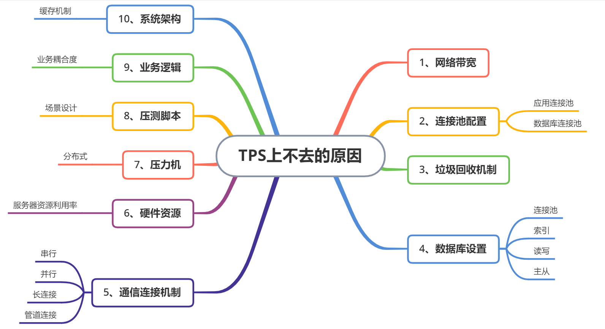

# 性能测试TPS上不去问题分析，思路整理

最近进程听到同学问我，在做性能测试的时候，TPS上不去，是什么原因？被大家这样一问，我真不好怎么回答同学的这个问题，因为这个问题，并不是同学们问题，并不是同学们想象中的，增加并发用户，TPS值就应该要上升。

那tps上不去，到底有哪些方面的原因呢，我这里大概给大家整理了一下，有以下10个方面的可能原因。

1、**网络带宽**：当你模拟大量用户发起请求的时候，单位时间内传递的数据包过大，超过了带宽的传输能力，造成网络资源竞争，间接的就导致了服务器接收的请求数达不到服务器的处理能力上限，tps值自然就不会上升。

2、**连接池**：连接池一般主要有两种，应用服务器连接池配置 和 数据库连接池配置，配置太小，连接数被占满了，新的连接只能等待，tps值也就自然不会再上升。

3、**垃圾回收机制**：JVM的垃圾回收GC都是基于算法的，如果新生代的Eden和Survivor区频繁的进行Minor GC， 老年代的full GC也回收频繁，那么对TPS就会有影响，因为垃圾回收本身占用一定的资源。

4、**数据库配置**：对数据库进行的读、写数据操作时，连接数、库表索引、读写分离、数据库主从方案等都有关系

5、**通信连接机制**：通信连接我们常见的有 串行、并行、长连接、管道连接等

6、**硬件资源**： 服务器硬件资源消耗过高，服务器处理不过来，tps也就上不去了

7、**压力机**：用jmeter做性能测试，一台机器并不能无上限的虚拟并发用户，想要高并发，可能机器根本虚拟不出预期的用户数，服务器tps自然也就不会上升。

8、**压测脚本**：我们都知道，性能测试，脚本是一方面，还要有性能场景设计，如果脚本+场景设计不合理，也不会达到预期的效果。

9、**业务逻辑**：如果被测系统业务耦合度非常高，一个功能相当于在测试整个系统了，这样的系统，tps也高不起来。

10、**系统架构**：现在比较常见的都是在服务器上会增加缓存机制，缓存的服务器配置、命中率、缓存穿透、缓存过期等等，都会影响性能结果。

好了，tps上不去的问题，可能的原因给大家简单整理了，大家对其中不理解得地方，可以自己去看相关资料学习。

---

> 更多有趣有料的测试相关知识，欢迎微信关注 **柠檬班** 微信公众号