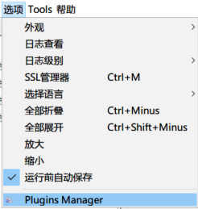
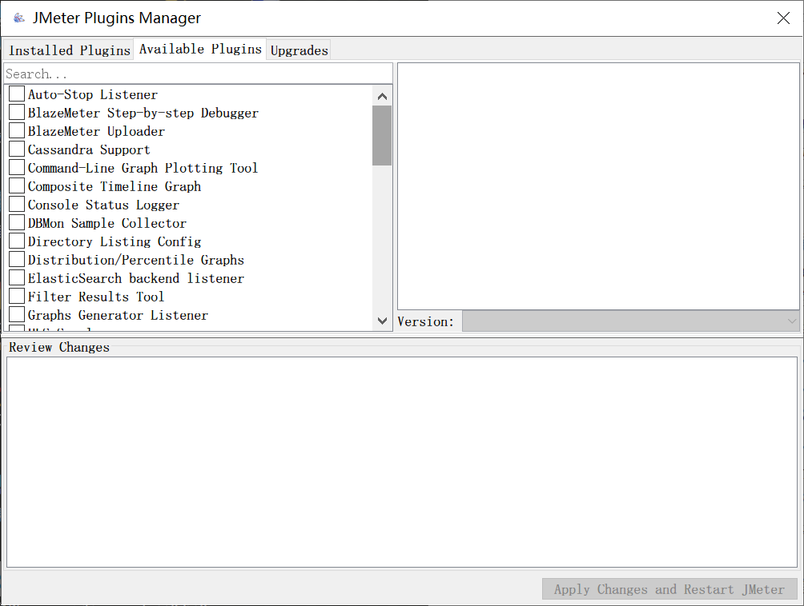
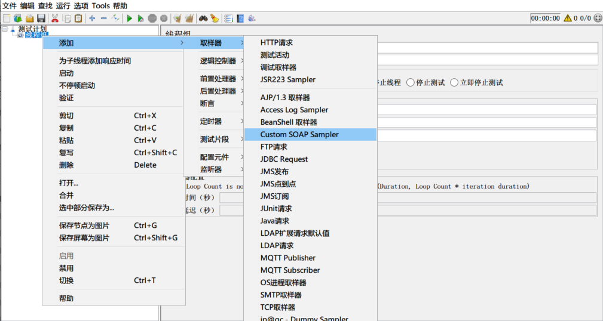
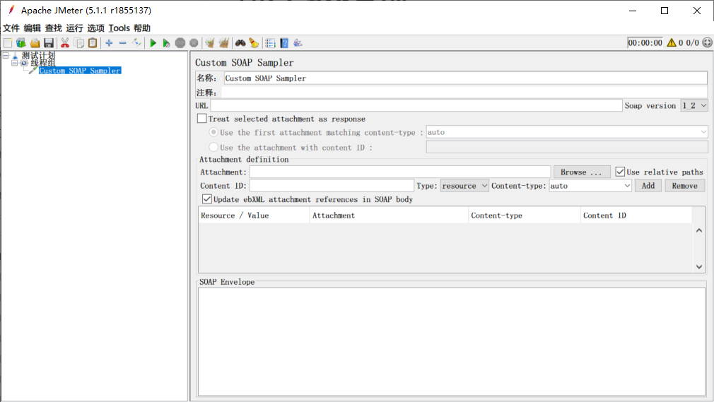

# 最新版本jmeter照样写soap协议接口

   很多企业现在都还在用soap协议的接口，同时，企业里面的测试人员，也大多都喜欢用jmeter来做接口测试。但是，现在大家在使用jmeter的过程中，可能又会遇到一个问题了，那就是，jmeter如何写soap协议的接口测试脚本。这个时候，你是不是就会去百度，可是百度的答案让你很意外，要么告诉你最新版本的jmeter不支持直接写soap协议接口，要换成http+xml模式写；要么就告诉你，用jmeter3.2版本去编写soap协议接口请求。

​	那是不是，就如你百度的那样，新版本的jmeter就不能直接发起soap协议请求了？*<u>如果企业有以前测试人员留下的jmeter3.2版本写的jmeter请求soap接口请求，现在就不能用了，必须全部重写？</u>*是不是看起来很恐怖？

​	那么，我今天就来告诉大家一个好消息，新版的jmeter照样可以写soap协议的接口，只要做好这两件事情，就可以完美兼容低版本写的脚本。

​	首先，在你的电脑上安装jdk1.8版本。呃，如果你已经在用jmeter了，你可能会喷我了，这不是废话吗？jmeter是用java开发的，需要java的运行环境，所有想要正常使用jmeter，都必须安装jdk。是的，要想正常运行jmeter，都必须先安装jdk，但是，注意，我给出的jdk版本—1.8  如果你现在去jdk的官网下载，你可能下载的都是10以上的版本。而我这地方说的版本是1.8而不是大家看到的最新版本。哪为什么要特别说明是1.8版本呢，因为我下面要讲的，我们将要下载的一个custom soap sample 是只在1.8上做全面测试，在更高的版本上，可能会出现无法使用的问题。如，你电脑执行java -version，得到一个12的版本。sorry，你的jdk版本太高，无法使用。

​	第二，打开jmeter，进入options > Plugins Manager (如果没有这个，则需要去下载jmeter的plugin-manager-*.jar包，然后放到jmeter的/lib/ext文件夹中，再启动jmeter)，

在弹出窗口中，选择Available Plugins 在搜索框中，输入soap 空格一下

  就会出现一个custom soap sampler 的插件，勾选，点击右下角的‘Apply Changes and Restart Jmeter’ 等待下载安装完成，会自动重启。

  重启后，添加线程组，右键 > 取样器 
  

此时，就会看到一个Custom SOAP Sampler的取样器。

在这个页面中，URL地址中，输入你要请求的地址(注意：默认soap版本是1.2)，然后在SOAP Envelope中粘贴soap1.2的请求xml。

​	至此，用新版本的jmeter就直接写出了一个soap协议的请求