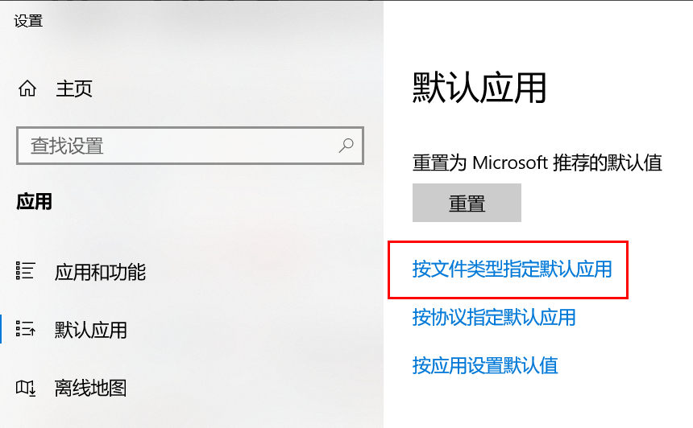
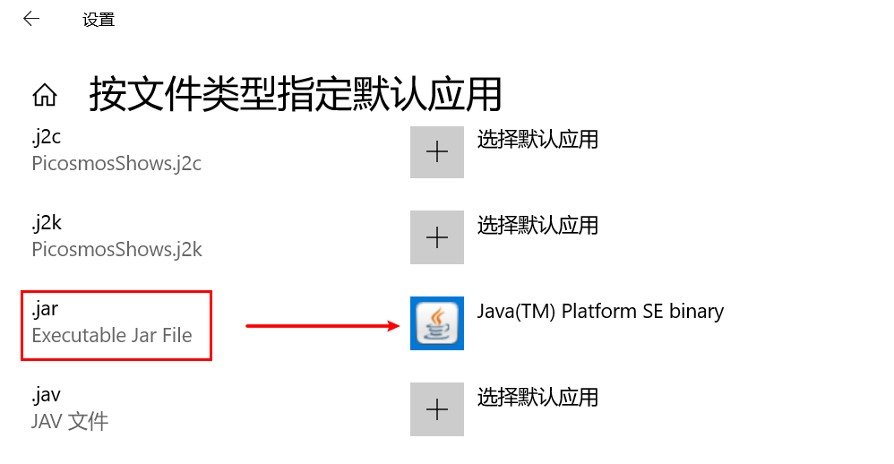

# 用jar包启动jmeter

jmeter工具，在windows下，用jmeter.bat文件启动，这个大家都知道。但是用jar包方式启动，很多同学会出现各种问题，今天，就给大家讲下，用jar包方式启动。

首先，我们看下，在jmeter的bin文件夹下，有个jmeter.bat文件。用记事本打开，大概在199行，我们可以看到这样一句话：

```bash
%JM_START% "%JM_LAUNCH%" %ARGS% %JVM_ARGS% -jar "%JMETER_BIN%ApacheJMeter.jar" %JMETER_CMD_LINE_ARGS%
```

从这个，我们就能看出，其实在jmeter.bat文件，启动时候，是去读取了我们 jmeter的bin文件夹中的ApacheJmeter.jar文件，我们是可以直接使用ApacheJmeter.jar这个文件启动jmeter的。

此时，你去找到你jmeter的bin文件夹中，如果看到一个**咖啡图标**的ApacheJmeter.jar文件，那么你就可以**直接双击**，即可启动jmeter了。

如果，你看到的**不是一个咖啡图表**的ApacheJmeter.jar，那你可以在当前文件夹的路径中，输入cmd，打开dos窗口，此时dos的路径，已经自动进入了当前的文件夹路径，然后在dos窗口中，执行

`java -jar ApacheJmeter.jar`

回车，执行，此时，jmeter的gui界面也就自动打开了。那，这种情况，还有没有其他方式呢？有，不是咖啡图标，是因为你的系统jar包，默认的打开方式不是用java。你可以找到系统的默认应用





找到.jar文件，选择 Java(TM) Platform SE binary 这样你的系统默认的jar包就是用java来运行了。以后再有jar包，都会是咖啡图标，jmeterbin文件夹中的ApacheJmeter.jar 就可以用双击方式启动了。